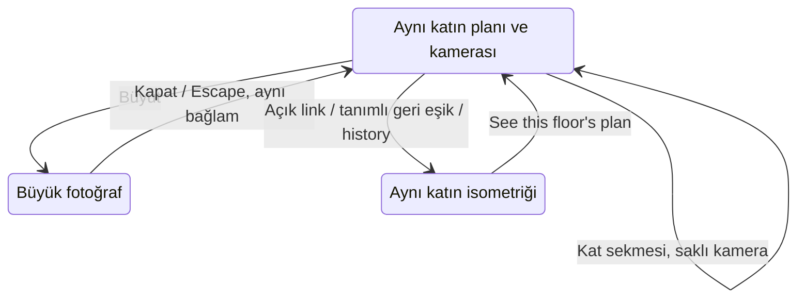

# web3 — ERA yönünde kurgu ve uygulama planı

İlk sürüm: 5 Ekim 2026 20:12:05 · Europe/Paris (UTC+02:00). **V2 / uygulama sözleşmesi denetimi: 5 Ekim 2026.** Durum: **yalnız plan; web3.html henüz uygulanmadı.** Sayfanın içeriği İngilizce, bu çalışma belgesi Türkçe olacak. web4 için Likova yönü ayrı tutulacak.

Bu planın iki kaynağı, kullanıcının 15:29 web2 ekran kaydı ve casestudy2'deki gerçek ERA desktop/mobil kayıtlarıdır. Canlı web2'deki ek deneme, aynı günün farklı bir gözlemidir; eski kaydın input yolunu geriye dönük kanıtlamaz. Yeni kurguya henüz 9 verilmedi. 9, uygulama sonrasında sağlanması gereken hedeftir.

V2 ayrıca mevcut kodu, kamera/contour verisini, medya manifestlerini ve dosya metadata'sını denetler. V1'in kurgu yönü kullanılabilir; **V1 doğrudan uygulamaya hazır değildi.** Aşağıdaki kararlar çelişen eski cümlelerin yerini alır. Ayrıntılı açıklar ve kalan kanıt ihtiyacı: [uygulama incelemesi](web3-plan-review-2026-10-05.md). Kaynak sayıları, gelecekteki performans veya fiziksel telefon onayı değildir.

## 1. Önce büyük hata: 28. kesit ne anlatıyor?

**D28 / 55.55–56.35:** Attic planı ve fotoğrafından Garden modeline sıçrama. Önceki 4.5, dört görsel ölçütün **devamlılık** boyutuydu; bir kontrolün doğru çalışıp çalışmadığının puanı değildi. Bunu yalnız sıradan bir geçiş değerlendirmesi olarak sunmak eksikti.

Kullanıcının belirttiği işlem **“plan fotoğrafına bas → isometriğe atıl”**. Bu, fotoğraf işleminin yanlış bölümü açmasıdır. **P0 / teslim engeli.** Kadrajın veya easing'in başarılı olması bu hatayı telafi edemez. D34'te de Entrance planı → Garden model dönüşü kaydedilmiş; aynı neden olup olmadığı ayrıca test edilecek.

Üç kanıt türü birbirine karıştırılmayacak:

- **Kullanıcı bildirimi:** fotoğraf işlemi isometriğe atıyor. Bu hata kapsamda ve bloklayıcı kabul edilir.
- **Kayıt:** yanlış model/kat durumuna dönüş görünür; her kesitte hangi tıklama veya scroll'un bunu tetiklediği seçilemez.
- **Canlı deneme:** Attic fotoğraf seçiminde ve Garden'ın ilk kamera seçiminde yaklaşık 311 px sayfa konumu değişimi görüldü. Attic büyütmede de konum değişti. Bu denemelerde aynı isometriğe atma yeniden üretilemedi. Browser'ın görünür hedefe getirme/focus hareketi de konum değişimine katkı yapabilir; click, focus ve scroll kaynakları ayrıca izlenecek.

**Doğru yerel işlem:** Attic plan → Attic kamera 1 → büyük Attic fotoğrafı → kapat → aynı Attic plan, aynı kamera, aynı sayfa konumu. Kamera/fotoğraf işlemi model bölümünü açamaz. Açık model linki, hikâyenin tanımlı geri eşiği veya browser history başka olay türleridir; bunlar aynı katı koruyarak modele dönebilir. Bu ayrım D28'i meşrulaştırmaz.

### Teslim barajları

| Sınıf | Örnek | Karar |
|---|---|---|
| P0 / işlev | Fotoğraf başka bölümü açıyor; kat kayboluyor; scroll'dan çıkılamıyor; modal kapatılamıyor | Teslim durur. Görsel puanla ortalaması alınmaz. |
| P1 / kullanılabilirlik ve tasarım | Plan pinlerle örtülü; mobil fotoğraf okunmuyor; menü ekran dışında; önemli bina kadrajdan kesilmiş | İlgili bölüm teslim edilemez. |
| P2 / görsel ayrıntı | Caption hizası, küçük easing farkı, yetersiz boşluk | Genel kurgu içinde düzeltilecek; kanıtlı ayrı not yazılır. |
| Doğrulanmadı | Kayıtta olmayan tıklama, fiziksel touch, ağ hatası | “Geçti”, “kusursuz” veya işlev onayı yazılmaz. |

“Koru” yalnız **kayıtta görülen tasarım yönünü koru** demektir. Fonksiyon, erişilebilirlik ve performans onayı ayrı sonuçlardır.

## 2. Mevcut tasarımın açık notları

Bu tablo yeni rastgele sayılar üretmez. Kaynak incelemesindeki **kadraj ve okuma** notlarını görünür hâle getirir. Bir bölüm ortalaması veya tüm sitenin tasarım puanı değildir.

| Tasarım konusu | Desktop kanıtı / kadraj–okuma | Mobil kanıtı / kadraj–okuma | web3 kararı |
|---|---|---|---|
| Filmden ilk metne çıkış | D05: 5 / 7 | M05: 5 / 7 | Pencere ve ev birlikte küçülecek; ev kaybolurken başlık yarım kalmayacak. |
| Oda fotoğrafları | D09: 8 / 7.5 | M08: 8 / 7 | Görsel oranları korunacak, kat ve oda altyazısı büyütülecek. |
| Havuz/teras bilgisi | D12: 8.5 / 6.5 | M10: 7.5 / 6.5 | Yazı doğru fotoğrafla eşleşecek; görsel altında sabit kontrast alanı. |
| İlk isometrik kadraj | D20: 6 / 7.5 | M25: 6.5 / 7.5 | Arsa ve bina bütünü aynı contain ölçeğinde sığacak. |
| Garden planı / kamera | D25: 7.5 / 6.5 | M30: 6 / 5.5 | Beyaz dev pinler kalkacak; gerçek konum, yön ve oda okunacak. |
| First planı / yoğun pinler | D26: 7.5 / 6 | M32: 5.5 / 5 | **P1.** 13 noktayı plana büyük diskler olarak yığmak kabul edilemez. |
| Attic planı | D27: 8 / 6.5 | M33: 6 / 5.5 | Plan ve seçili fotoğraf için dengeli alan; tüm odalar görünür. |
| Çevre haritası | D45: 8 / 6.5 | M37: 6.5 / 6 | Villa kenarda kesilmeyecek; küçük nokta yerine okunur ölçek/legend. |
| Angora ikinci fotoğrafı | D47: 8.5 / 7.5 | M39: 8.5 / 8 | İkinci resim var; konu ilişkisi korunacak, kontrollü ayrı giriş. |
| Galeri açıklamaları | D50: 8.5 / 7.5; D52: 8 / 7 | M41: 8 / 7.5 | Fotoğraf adı/katı net; boş ve mobilyalı fotoğrafın bağlamı açıklanacak. |
| Büyütülmüş fotoğraf | D54: 9 / 7.5 | Mobil açılış kayıtta yok | Görsel kadraj iyi; Close/caption küçük. 9 kadraj puanı, modal işlev onayı değildir. |
| Fiyat/viewing kartı | D59: 6.5 / 8 | M42: 5.5 / 7.5 | Fotoğrafın önünü bütünüyle kapatan kart kaldırılacak. |

### Mobil planın yeniden tasarımı

**Planın kendisi ana bilgi; numaralar onun üzerine çıkamaz.** Pinlerin koordinatları kullanıcının fotoğraf-konum çizimine ve poses.json'a bağlı kalır. Noktaları repulsion ile yerinden taşıyıp oda konumunu belirsizleştirmek yerine, yakın seçimlerin kontrolü ayrıca çözülür.

- Ayrık pasif numara: başlangıç 14–16 CSS px çap; aktif numara 18–20 px. Yakın ankrajlarda numaraları üst üste bindirmek yerine gerçek noktalar ve ortak seçim göstergesi kullanılır. Bütün kameralar alt seçicide kendi 1…N numarasıyla bulunur. Bunlar prototip ölçüleridir, final onay değildir.
- Her gerçek kamera ankrajı ince nokta olarak kalır. **Yalnız aktif kamera dolu bakış konisi taşır**; pasif kameraların yönü kısa, ince yön iziyle gösterilir. 13 yarı saydam koniyi üst üste yığmak yok. Kamera bulunduğu yerden bakar; koni taşınmış numaranın merkezinden çıkmaz. Koninin çizim uzunluğu sunum ölçüsüdür; kaynakta lens açısı yoksa fiziksel FOV diye sunulmaz.
- Konturlar gerçek mimari sınırları izler. Oda merkezlerini birleştiren diyagonal üçgenler, oda bölme çizgileri ve çizilerek oluşan duvar efekti yok.
- Oda adları 12–14 px; kat adı 14–16 px; fotoğraf başlığı 18–22 px. Adı sığdırmak için 7 px yazıya düşülmez. Kısaltma gerekiyorsa tam ad fotoğraf/schedule alanında görünür.
- Bütün numaralar kat içinde 1…N: Garden 9, Entrance 10, First 13, Attic 8 kamera. Ham dosya/id numarası kullanıcıya gösterilmez.
- Küçük görsel pinlerin üzerine çakışan 44 px görünmez hedefler yığılmayacak. Yakın noktalar tap'te aynı katın alt kamera seçicisinde açık seçeneklere ayrılır. Seçicide her hedef en az 44 × 44 px; pinler planda aynı gerçek yerinde kalır. Yanlış kameranın “yakın olduğu için” seçilmesi kabul edilmez.
- Default dar ekranın bütçesi **önce kontrollerin ölçülen yüksekliğinden** çıkarılır. `H = küçük viewport − safe-area − üst kontrol rezervi`; `R = H − tab − kamera seçici − caption − boşluklar`. Başlangıçta R'nin yaklaşık 2/3'ü plan, 1/3'ü fotoğraf; prototip alt sınırları 240 px plan ve 120 px fotoğraftır. Bu sınırlar okunabilirlik denemesiyle değişebilir; yüzde tek başına geçme ölçütü değildir.
- Örnek: 568 px yüksekliğinde, 48 px üst rezervle H=520; tek satır tab 44 + seçici 44 + caption 28 + boşluklar 16 =132; R=388, yaklaşık 259/129 px. İki satır tab ek 44 px ister ve bu alt sınırları aşındırır. Gerçek font, safe-area ve toolbar ölçümü olmadan “sığıyor” denmez. R<360 olduğunda sabit sahne yerine aynı durumla native düşey düzen; landscape'te uygun iki kolon. Kritik bilgi kesilmez, yazı küçültülmez.
- Kat tabları dar ekranda kısa, erişilebilir tam adı olan tek satırdır. Yatay taşma yalnız tab satırında yönetilir; sayfaya taşmaz. Tek bir kata tıklama bir tek hedefe gider. Fotoğraf ve plan aynı kat birimiyle kayar. Kamera seçicisindeki yatay swipe, düşey kat geçişini tetiklemez.
- “Expand plan” geri eklenmez. Ölçüler ayrı bir görünüm tercihi; aynı kat ve fotoğrafı değiştirmez.

## 3. Genel creative direction

**İngilizce bir ev anlatısı:** caddeye varış → evin ölçeği → odalar → bahçe/havuz → birlikte yaşama → bağımsız katlar → gerçek plan/fotoğraf ilişkisi → Angora'da günlük hayat → satış fırsatı → çizgisel ev ve eylemler.

ERA'dan alınacak ana dil: mimari pencere, öncekinin üzerinde haber verilen yeni yüzey, farklı hızlarda ilerleyen fotoğraf–caption çiftleri, ortak odak etrafında büyüme/küçülme ve aynı hareketin doğru ters okunması. Geçiş, gelen içeriğin neden geldiğini anlatacak.

Renkler: kırık beyaz `#efede6`, koyu yeşil `#223e35`, cephenin buz mavisi `#b7cdd7`, sonbahar kahverengisi `#5c4133`. Bunlar mevcut marka paletidir. Model zemini saf beyaz olacak; stage, video/canvas kenarı ve üst/alt iç paylar aynı beyazı kullanacak. Buz mavisi model çevresinde ayrı bant oluşturmayacak.

Gövde/teknik metin için başlangıç çiftleri forest→paper/ice ve paper→forest/brown; her gerçek opacity/arka plan birleşimi ölçülür. Küçük metin kontrastı en az 4.5:1; gerekli kontrol ve plan çizgisi en az 3:1 hedefler. Forest üzerine brown veya düşük opasiteli ice ince yazı varsayılan değildir. Palet uyumu, ölçülen kontrastın yerine geçmez.

Tipografi: Cormorant Garamond 500 yalnız büyük editoryal başlıklarda; Manrope 400/500 gövde, plan, caption ve kontrollerde. İnce serif küçük teknik yazıda kullanılmayacak. Genel başlangıç hedefleri:

| Rol | Desktop | Mobil | Koşul |
|---|---|---|---|
| Hero | 88–128 px, en fazla 3 satır | 48–64 px | Villa odağını kapatmaz; satır maskesinde inen harfler kesilmez. |
| Bölüm başlığı | 56–80 px | 34–44 px | Doğal İngilizce satır kırımı, sabit <br> zorlaması yok. |
| Ana paragraf | 17–19 px / 1.65 | 16–17 px / 1.6 | 45–65 karakter satır; görsel üzerine kontrolsüz yayılmaz. |
| Caption/teknik bilgi | 12–14 px | 12–14 px | Kontrastı görselden bağımsız; hover şartı yok. |
| Nav/kontrol | 12–14 px | 13–14 px | En az 44 px hedef; masaüstü tüm nav sığmayınca kompakt menü. |

Başlıklar karakter karakter gereksiz gösteri yapmayacak. 2–4 satırlık kısa reveal kullanılacak; paragraf onu izleyecek. Kat duraklarında tamamlanmış metin ayrıca solmayacak.

## 4. Etkileşim sözleşmesi ve ortak durum

Bu uygulamanın en önemli değişimi animasyon eklemek değil, **bölüm hareketi ile yerel kontrolü ayırmaktır**.

Önerilen durum:

```text
committed: section / technicalCursor / cameraByFloor[4] / planMode
           galleryFilter / galleryPhoto / semanticAnchor
presentation: committedStateId / readyMediaId / frozenLayout
pending: requestId / targetState / phase = preparing | playing | committing
overlay = none | menu | photo
overlayOrigin = immutable state + photoCollection + anchor + focusedControl
historyEntry = navigationId / section / technicalCursor / localSelections
```

`technicalCursor` tanımlı teknik rotanın tek kimliğidir; `activeFloor` ve iso/plan modu bu imleçten türetilir. Ayrı bağımsız `localStep`/kat/index tutulmaz. Normal teknik rota:

```text
iso Garden → Entrance → First → Attic
                                ↓ aynı kat
plan Attic → First → Entrance → Garden → konfor
```

Her katın son seçili kamerası hafızada kalır. İlk teknik ziyaret Garden iso; direkt Plans bağlantısının ilk ziyareti Attic plan; sonraki ziyaret saklı kat. Yeni sayfa URL'si geçerli bölüm/kat/kamera içeriyorsa o durum açılır. Geçersiz değerler aynı bölümün tanımlı ilk durumuna alınır; başka bölüme sessiz sıçrama yok.

Ekrandaki fotoğraf, koni, oda başlığı ve kontrolün **committed** durumu aynı kimliği taşır. Pending hedef yüklenirken eski tamamlanmış durum görünür. Hedef bütünü hazır olunca birlikte commit edilir; hazırlıkta yeni başlık/eski fotoğraf karışmaz. Her async callback requestId ve mevcut overlay/route sahipliğini kontrol eder. Öncelik: açık navigation/overlay > açık kat seçimi > yerel kamera seçimi > aynı gesture'ın momentum olayları. Yeni açık kontrol isteği eskisini geçersiz kılar; devam eden wheel serisinin artıkları yeni istek değildir.

| Eylem | Değişebilecek durum | Korunacak durum | Beklenen sonuç |
|---|---|---|---|
| Kamera noktası / thumbnail | Aynı katın cameraByFloor kaydı | bölüm, kat, scrollAnchor | Seçili fotoğraf, koni, oda ve numara birlikte güncellenir. |
| Oda adı | Aynı odanın ilk veya son seçili kamerası | bölüm, kat, scrollAnchor | Odaya ait fotoğraf; fotoğraf yoksa açıklama, başka kat değil. |
| Fotoğraf büyüt | overlay + returnContext | bölüm, kat, kamera, sayfa Y | Aynı fotoğraf modalda contain görünür. |
| Modal kapat / Escape | overlay | tüm returnContext | Aynı fotoğrafa ve butona preventScroll focus ile dönülür. |
| Kat sekmesi | technicalCursor + o katın saklı/default kamerası | plan/iso modu ve sahne ankrajı | Plan+fotoğraf tek yatay geçiş; fotoğraf işlemi değildir. Tab seçiminden sonraki scroll rotada bu kattan devam eder. |
| Ölçüler | planMode | bölüm, kat, kamera, fotoğraf, Y | Seçili odanın okunur ölçüleri; pin seçimi çalışır. |
| See this floor's plan | section=plans | activeFloor, cameraByFloor | Aynı kat planı; Garden'a zorlanmaz. |
| View isometric | technicalCursor'ın aynı kat iso karşılığı | kat ve kamera hafızası | Açık mode navigation; fotoğraf/kamera olayı bu işlemi çağıramaz. |
| Plan içi dikey scroll/swipe | technicalCursor → rotadaki bir komşu | fotoğraf seçim hafızası | Aşağı: Attic→First→Entrance→Garden→konfor; yukarı tam tersi ve Attic plan→Attic iso. |
| Kamera şeridi yatay swipe | şeridin kendi offset'i | sayfa Y, kat, localStep | Kameraları gezdirir; kat veya bölüm değiştirmez. |
| Model orbit | yalnız azimuth | sayfa Y, ev merkezi | Pan ve dolly/zoom yok; wheel sayfa scroll'una kalır. |
| Menü aç/kapat | overlay | alt sahne durumu | Menü kapanınca aynı sayfa ve kat; timeline yeniden başlamaz. |
| Uzak menü linki | section + hedef anchor | son kat/kamera seçimleri | Hedef sahne tamamlanmış doğru duruma kurulur. |
| Browser back / forward | sahipliği kaydedilmiş historyEntry | ilgili selection hafızası | Yeni history kaydı üretmeden restore; önce pending iptal. Modal kaydıysa önce modal kapanır. |
| Resize / address bar / font yüklenmesi | layout ölçüleri | tüm anlam durumu | Cover↔contain değişmez; kat/fotoğraf reseti yok. |
| Medya hatası / yavaş yükleme | hareket yerine final still | hedef kat/bölüm | Scroll serbest kalır; sonsuz preparing/busy yok. |



### Scroll sahipliği

- Video/kat sahnesinde **bir kabul edilen gesture kümesi = bir tamamlanan geçiş**. Wheel event bir mouse çentiğiyle aynı şey değildir. px/line/page delta normalize edilir; trackpad momentum kümelenir; `ctrlKey` zoom ve yatay baskın input sahne geçişine alınmaz. Süre mouse delta'sından türemez. Gesture eşiği/quiet aralığı hardware prototipinde ayarlanır; tek evrensel çentik detektörü varsayılmaz.
- Sahne sahibi yalnız kendi aktif, zaten tam hizalı sticky alanında engelleyebilir. Wheel listener burada açık `passive:false`; yalnız cancelable event'te preventDefault. İlk event native kaydırılıp ardından scrollTo ile düzeltilmez. Native yaklaşma→sabit sahne ve son duruş→native çıkış ayrı eşiklerdir: girişte bir ekstra “yerine oturtma scroll'u” ve çıkışta görünür Y sıçraması kabul edilmez. Bu mekanizma üç ana prototipten biridir; cümle yazmak çalıştığını kanıtlamaz.
- Touch sahipliği gesture başlamadan CSS `touch-action` ile tanımlanır; ortasında değiştirilmez. Teknik step sahnesi tek parmak düşey gesture'ı yönetebilir, pinch zoom açık kalır; kamera strip yatay gesture, wireframe yatay orbit, modal kendi kontrolleri için ayrı bölgedir. Normal içerik native düşey scroll'dur. `pointercancel`, ikinci parmak, tab değişimi ve gesture sahne dışına çıkış pending input'u temizler. İzin verilen native pan'i JavaScript'in sonradan devralacağı varsayılmaz.
- Kamera strip'te yön ayrımı yapılana kadar kat sürücüsü istek üretmez. Modelde yatay drag orbit, düşey drag native sayfa; `touch-action:none` bütün viewer'a otomatik kopyalanmaz. Kısa/zoomlanmış ekran veya input kurulumu başarısızsa native düzen + kat tabları kullanılır. Genel document/body üzerinde kalıcı touch kilidi yok.
- Button/link/input/select/textarea/contenteditable, menu/modal içi scroll ve orbit drag'i genel sürücüye olay göndermez. Space/ok/PageUp/PageDown input yazarken çalınmaz. Tab ve focus hareketi sahne geçişi değildir. Focus geri dönüşü `preventScroll` ile yapılır; gerçek klavye odağı görünür kalır.
- Busy sırasında momentum kuyruklanmaz. Açık yeni tab/navigation anında eski isteği geçersiz kılabilir. Yeni ve belirgin ters gesture için bir hedef tutulabilir; mevcut video yarısında ters kare sıçraması yapmadan güvenli duruşa varır, sonra tek ters adım. Geri scroll kilitte kaybolmaz; iki hareketin kaç kez commit olduğu olay kaydında görünür.
- Wheel dışındaki scrollbar drag, Home/End, browser restore ve programmatic jump bir piksel eşiğinden tahmin edilmez. Bunlar hareketleri oynatmadan hedefin tamamlanmış durumuna restore edilir. Yerel camera/photo işlemlerinin Y toleransı normal durumda en fazla 1 CSS px; resize/zoom sonrası aynı semantik anchor aranır, eski ham Y zorlanmaz.
- Sabit sahneden çıkış girişinin ters geometrisini kullanır. Hero'da üç gesture üç kamera klibini bitirir; üçüncü klibin final bilgisi durur. **Bir sonraki gesture T06 çıkışıdır**; üçüncü input aynı anda hem kamera hem bölüm çıkışı değildir.
- Scroll lock tek sahibi olan idempotent controller'dır. Photo/menu birbirinin kilidini açamaz. Overlay sırasında rota, timeline ve galeri filter donuktur; focus trap ve kapatınca focus iadesi uygulanır. Escape tek overlay'ı kapatır. Açık menüden navigation eski pending ve overlay origin'i kontrollü bırakır.

### URL, geri dönüş ve kesilen işlem

Açık bölüm/mode navigation history'ye bir kayıt ekler; sürekli wheel/floor ilerlemesi mevcut kaydı replace eder, onlarca Back durağı yaratmaz. Modal açılışı uygulamanın sahiplik işaretiyle tek kayıt ekleyebilir; Close yalnız kendine ait kaydı geri alır. Deep link ile açılmış modal kapatılırken kullanıcı başka siteye gönderilmez. `popstate` yeni push yapmaz. Geri/ileri, reload, BFCache ve sayfa görünürlüğü kaybında restore/iptal ayrı test edilir. URL'de bölüm/kat/kamera/fotoğraf kimliği doğrulanır; JS kapalıyken normal anchor ve fotoğraf bağlantıları yine işe yarar.

Modal origin'i açılış anında sabitlenir. Geç gelen image load veya floor callback'i origin'i yeniden yazamaz. Büyük fotoğraf yüklenmezse eski fotoğraf kalır, okunur hata ve Close vardır. Kapanış tekrar çağrılabilir; ikinci çağrı yeni navigation/lock yan etkisi üretmez. Geçiş ortasında modal açılırsa önce görünür committed kaynağa bağlanır, pending floor iptal edilir; yarım yeni katın eski fotoğrafı açılmaz.

## 5. Hareket aileleri ve zamanlar

Başlangıç süreleri tasarım önerisidir; uygulanmış ölçüm değildir. Tüm girişler için aynı sırayı kopyalamak yerine aşağıdaki aileler sahnenin görevine göre seçilir.

| Aile | Görevi | Başlangıç zamanlaması | Final / ters yön |
|---|---|---|---|
| A — kamera filmi | Evin çevresinde hedefli yolculuk; kaynak türü ayrıca açıklanır | web2 runtime 0.70 sn; mevcut oynatımın 3× hedefi ≈0.233 sn. Kaynağın 3×'ı ≈1.685 sn farklı, daha yavaş bir karardır; bunun kullanıcı tarafından onaylandığı varsayılmaz. Ritmin çözümü aşağıdaki prototip barajında. | Tam final kare sabit; ters rota önceden encode edilir; backward seek kullanılmaz. |
| B — mimari yüzey devri | Yeni bölüm rengini/biçimini öncekinin üstünde tanıtma | 0.85–1.1 sn, orta bölümde yumuşak hız | Yeni zemin %100 devralmadan eskiyi kaldırma; geri aynı geometri. |
| C — fotoğraf/caption kolonları | Farklı mekânları bir editoryal akışta anlatma | Native ilerleme + düşük genlikli 24–48 px paralaks; içerik reveal 0.65–0.8 sn | Caption kendi fotoğrafıyla aynı blok; yeniden girişte gereksiz reveal yok. |
| D — teknik kat rayı | Model veya planın tek kat değişimi | Plan yatay kayma 0.9–1.0 sn. Iso web2 runtime 0.55 sn; mevcut oynatımın 3× hedefi ≈0.183 sn. Native kaydın 3×'ı ≈0.478 sn farklıdır. Hızlı rota final süre/fps'te yeniden kaydedilerek denenir. | Son kat geometrisi + metin bir kez commit; durakta opacity 1. |
| E — yerel fotoğraf/overlay | Seçim ve büyütme | Fotoğraf 0.25–0.35 sn; büyütme 0.45–0.6 sn | Eski fotoğraf yenisi decode olmadan kaybolmaz; Y aynı. |
| F — footer karşı hareket | Fotoğrafın boşalttığı alana çizgisel ev ve eylemleri yerleştirme | 0.9–1.1 sn, ortak ilerleme | Görsel ve footer birlikte; ters dönüşte kart/fotoğraf durumu tam. |

Maske ve sahne büyütmede `power2.inOut`/benzer sakin hız ailesi; metinde `power2.out`. Expo.out yalnız gerçekten hızlı yerel tepki gerektiren küçük kontrol için değerlendirilecek. Her sahneye uzun inertial easing eklenmeyecek.

### Hız, kare ve yükleme barajı

**V1'in 1.68/0.48 sn hesabı 3× mevcut oynatım değildir.** Kaynak master 5.056 sn/121 kare/24 fps; iso master 1.433 sn/43 kare/30 fps. web2 türevleri hero 41, iso 22 karedir. Mevcut runtime ve kaynak manifestindeki `transitionSeconds` de farklıdır. web3'te süre tek build manifestinden gelir; clip duration, stage süresi ve metin commit zamanı ayrı sabitlerden çatışmaz.

Kullanıcının mevcut geçişi 3× hızlandırma talebi ilk prototipte 0.233/0.183 sn olarak **görülür ve ölçülür**. 60 Hz'de bunlar yaklaşık 14/11 görüntü yenilemesidir; yüksek MB veya 120 karelik dosya bu kısa aralığa daha çok görünür zaman eklemez. Eski durak hemen silinmez: tek gesture filmi bitirir, final bilgi sonraki gesture'a kadar kalır. Uygulanmadan bu sürelerin premium/9 olduğu söylenmez. 1.685 sn'ye sessiz geri dönüş de yapılmaz. Hız ve hareket okunurluğu birlikte sağlanamazsa engel ve alternatif süre gerçek karşılaştırma ile gösterilir; “onaylandı” yazılmaz.

Ana aday oynatıcı, **scroll scrub yerine zamanla oynayan muted/playsinline video**: ileri ve ters rotalar ayrı, hedef süreye retime edilmiş dosyalardır. Negatif playbackRate veya her wheel'de currentTime seek kullanılmaz. Video playback'in bu kadar kısa klipte ilk-frame gecikmesi fiziksel telefonda ölçülmeden seçim kesinleşmez. Kullanım anında play promise ve ilk sunulmuş frame beklenir; poster sadece ondan sonra bırakılır. Bitişte aynı encode'dan alınmış final poster hazırken video kaldırılır. Poster/video boyut, renk profili, crop ve hedef ev odağı eşleşir. `play()` ret veya hazır-olmama yolu kilit bırakmaz. [MDN: play](https://developer.mozilla.org/en-US/docs/Web/API/HTMLMediaElement/play).

Video prototipi ilk-frame/bitiş devamlılığını sağlamazsa ikinci aday **sınırlı boyutta, ölçülen bellek bütçeli bitmap cache**; bütün kliplerin tüm kareleri sürekli decode edilmez. Aynı kaynak için video+bitmap birlikte resident bırakılmaz. Mevcut 1152×648×41×4 ham alt sınır yaklaşık 116.8 MiB; mobil 640×360×41×4 yaklaşık 36.0 MiB'dır. Bunlar gerçek peak ölçümü değildir, tarayıcı/GPU/diğer resimler hariçtir. Görülen sahne + bir sonraki hazırlık, iptal edilen decoder'ın kapanması ve kullanılmayan kaynağın release edilmesi test edilir.

Medya beklenirken anchor kilitlenip 2.6 sn hiçbir tepki verilmez. Eski tamamlanmış frame görünür, ilerleme durumu erişilebilir şekilde bildirilir; kısa hazırlık süresi aşılırsa hedef poster veya native devam kullanılır. Süreler prototipte belirlenir. T01'in bilinçli siyah örtüsü tek açılış katmanıdır; kamera/katlar arasına loader siyahı girmez. Night→day veya farklı perspektifte iki bina üst üste dissolve edilmez. Kaynaklar arasında ortak kadraj yoksa geçişin yüzey devri açıkça tasarlanır; olmayan sürekli kamerayı varmış gibi sunmayız.

## 6. Baştan sona kurgu: 49 tanımlı işlem

T numaraları **49 farklı zorunlu efekt** demek değildir. Bölüm eşikleri, tekrar edilen üç kat adımı, kontroller ve hata yolları açık sözleşmeler olarak ayrılır. Ortak motor kullanılabilir; içerik, odak, mobil oran ve varış her sahnede ayrı tanımlanır.

### Açılış ve evin ilk anlatısı

| ID | İşlem | Desktop kurgu | Mobil karşılığı | Katman sırası / kabul |
|---|---|---|---|---|
| T01 | Siyah örtü → ilk aerial | Siyah örtü açılırken evin hedefi aynı yerde; marka bitmiş kompozisyona yerleşir. ERA E01/E02'nin kimlik-önce sırası. | Dikey oran için ayrı focal point; logo evi kapatmaz. | Arka ilk kare hazır → örtü açılır → kimlik. Boş siyah frame beklenmez; poster fallback. |
| T02 | Gündüz → akşam | Aynı aerial üstünde ışık geçişi; yeni gündüz kamerasıyla iki ayrı perspektif üst üste gelmez. | Marka ve alt açıklama kararmadan bağımsız kontrastta. | Kimlik tamam → ışık → okuma durağı. İlk kaydın göstermediği loader'a olmuş gibi not yok. |
| T03 | Arrival kamera | Cephe ve varış yolunu anlatan tek rota; eski gece görünümü yeni gündüz cephesine dissolve ile çift ev üretmez. | Ev/havuz odağı dikey görüntüde korunur; çevre crop'u önceden belirlenir. | Önce eski metin kapanır, kamera oynar, varış başlığı açılır. Bir gesture, bir rota. |
| T04 | Perspective kamera | Çatı, bahçe ve havuz ilişkisini daha yüksek açıdan kurar; T03'ün kopyası değildir. | Caption resmin altındaki sabit, kısa alanı kullanır. | Arrival yazısı hareket başlamadan çıkar; Perspective varışta görünür. |
| T05 | Garden kamera | Son cephe, teras ve suyu birlikte okutacak tam duruş; çıkış için ev merkezi kaydedilir. | Binanın tamamı ya da açıkça seçilmiş anlamlı kadraj; rastgele çatı crop'u yok. | Varış finali → kısa bilgi. Duruşta sürekli yeniden solma yok. |
| T06 | Film → ev özeti | ERA E20 gibi pencere geri çekilirken açılan alan bilgiyle dolar. Film ve pencere **aynı ev odağında** scale down; ev üst şeride kesilmez. | Aynı süreç daha az küçülme ile; final görüntü metin üstünde okunur bir oranı korur. | Ev küçülürken yeni paper yüzeyi haber verir → başlık → paragraf → değerler. Hero'nun rengi tek frame'de kesilmez. |
| T07 | Başlık → alan bilgisi | 500/400/900/5+4 bilgisi açıklamasıyla birlikte dört dengeli blok; sayı saydırma yok. | 2 × 2, gövde yazısı küçülmez; alan adları en az 12 px. | Alan değerleri approximate/listing kaynak notuyla gelir. Başlık kapandıktan sonra anlamsız yalnız sayılar kalmaz. |
| T08 | Cadde fotoğrafı → arrival açıklaması | Fotoğraf solda, metin sağda ERA E16 kolon bağı; hafif iç zoom ve düşey paralaks. | Resim → kısa açıklama; tam giriş/çatı okunur. | Kendi caption'ı fotoğrafla aynı hızda; gerçek cadde resmi. |
| T09 | Arrival → odalar | Son cadde alt kenarı ilk yatak odasının gelişiyle bağlanır; uzun beyaz boşluk yok. | İlk resim üstte, başlık ve kat bilgisi yanında/altında. | Yeni oda ve bölüm başlığı doğru sırada; görüntüye bilgi gelmeden geçilmez. |
| T10 | Üç oda fotoğrafı | ERA E16/E26: farklı genişlikte fotoğraf kolonları, sabit kısa başlık. Her oda ayrı caption; üç farklı oda tek mekânmış gibi birleştirilmez. | Native yatay fotoğraf şeridi, 16:9/4:3 gerçek oran; ikinci kenar devamı anlatır. | 1→2 ve 2→3 için farklı kat/oda caption'ı. Son fotoğrafın bitişi bahçe yüzeyini haber verir. |

### Bahçe, evin içi ve mutfaklar

| ID | İşlem | Desktop kurgu | Mobil karşılığı | Katman sırası / kabul |
|---|---|---|---|---|
| T11 | Odalar → tam ekran havuz | ERA E06/E21 yüzey devri: havuz görseli önce küçük alt kenarda görünür, sonra devralır; hafif mimari tepe yalnız bu eşikte. | Tepe yüksekliği dar ekran için ayrı; eski fotoğraf küçülmeden yeni film zoom/fitlemesi yok. | Havuz kadrajı → More sky / More time → The pool durumu. Başlık henüz terrace fotoğrafıyla eşleşmez. |
| T12 | Havuz → kapalı teras | ERA E14 seçim–görsel–bilgi senkronu. Teras alttan sakin devralır; iki farklı resme sahte birleşme yok. | Fotoğraf içi hedef terasın saçak/oturma alanı; bilgi okunur kısa banda. | Yeni fotoğraf dominant olunca başlık ve seçim tek commit. Önceden Garden yazısı gelmez. |
| T13 | Teras → bahçe yolu | Aynı pencere, daha küçük ölçek hareketi; bahçenin olgun bitkisi esas konu. | Yaprak üzerindeki metin için sabit kontrast; resim arkasında kırpılmış yol değil. | Garden başlığı yol fotoğrafıyla aynı durumda; geri yönde T12'nin ters eşleşmesi. |
| T14 | Bahçe → salon | ERA E15: paper iç mekân yüzeyi bahçenin önünde görünür; sonra salon fotoğrafı ve başlık. | Aynı geometri, daha alçak maske yüksekliği. | Yeşil→paper sert kesilmez. Son bahçe fotoğrafı gereksiz boş kutuya dönüşmez. |
| T15 | Ana salon → ikinci açı | Büyük salon ve küçük yemek detayı farklı hızda ilerler; tek fotoğrafın zoom'u olarak sunulmaz. | Ana salon → açıklama → ikinci açı; kolonları iki dar şeride sıkıştırma yok. | Geniş resim ana görevi, küçük resim ayrıntıyı taşır; doğru Entrance caption. |
| T16 | Salon → özel oda | Daha sakin ikinci editoryal çift: bedroom + dressing. Önce küçük privacy başlığı, sonra suite görseli. | Bedroom büyük; dressing ayrı daha küçük ama okunur resim. | İki odayı eritme yok; doğal boşluk en fazla tek kısa okuma aralığı. |
| T17 | Özel oda → mutfaklar | Yeşil yüzey önce alt kenarda, ilk mutfak sonradan. Gather başlığı yeni fotoğrafla eşleşir. | Aynı tek kolon; header başlığı kesmez. | Mutfak rayı kurulmadan model sahnesinin ilk frame'i sızmaz. |
| T18 | Ana mutfak → Garden mutfağı | Fotoğraflar aynı rayda; farklı bağımsız kullanım açıklaması. | Tek gesture/swipe bir resim; oranlar korunur. | Caption ve fotoğraf aynı birim; ölçüsü farklı resim cover ile rastgele kesilmez. |
| T19 | Garden mutfağı → Attic kitchenette | Son fotoğraf daha küçük mekânı olduğu gibi anlatır; ana mutfak genişliği taklit edilmez. | Kaynak oranı ve alt caption korunur. | Ray tamamlanır → üç mutfak anlatısı kapanır → model eşiğine izin verilir. Geri dönüş aynı son fotoğrafa. |

### Katlar, gerçek planlar ve fotoğraflar

| ID | İşlem | Desktop kurgu | Mobil karşılığı | Katman sırası / kabul |
|---|---|---|---|---|
| T20 | Mutfaklar → isometri | Beyaz teknik yüzey fotoğraf rayının altından gelir; bina ve arsa büyük ama bütün. ERA E13 bilgi hiyerarşisi; gerçek modelde kavis efekti taklit edilmez. | Daha yüksek, temiz model alanı; metin ayrı kısa alt alan. | Stage/canvas/final still tek contain hesabı; kayda geçerken zoom-extents yok. |
| T21 | Garden → Entrance iso | Kesit düzlemi gerçek kat yüksekliğine ilerler, kamera ve ölçek sabit; Garden arsa kırpığı kaldırılır. | Aynı rota, dar ekrana göre aynı model extent'i sığdırılır. | Fotoğraf kontrolü değil, kat scroll/tab işlemi. Metin finalde tek commit; durakta hiçbir fade yok. |
| T22 | Entrance → First iso | Bir önceki katın cephe/merdiven ekseni korunur; yatak odası katı gerçek geometriyle görünür. | Daha az çevre alanı, aynı bütün bina sınırı. | First başlığı final geometriyle birlikte gelir; eski paragraf yarı saydam kalmaz. |
| T23 | First → Attic iso | Çatı altının kendi ölçeği ve kullanımı; son katın tam duruşu okunur. | Başlık 2 satıra sığar; model alttan kesilmez. | Plan girişinin ilk frame'i Attic bilgi durağını erken tüketmez. |
| T24 | Iso ↔ plan bağı | **Aynı kat korunur.** Normal akış Attic iso→Attic üstten grafik. Kamera/projeksiyon gerçekten eşleşmiyorsa çizgi morph'u yapılmaz; aynı kat adı korunarak kontrollü fade/yüzey devri. ERA E20 yalnız bilgi/ölçek ilkesi. | Önce aynı kat kimliği, sonra hazır plan+fotoğraf; farklı planların diyagonal morph'u yok. | Birebir ERA kat→plan efekti mevcut değildir. Plan noktasına click bu hareketi başlatamaz. Açık same-floor mode linki normal rota dışındaki katlarda da çalışır. |
| T25 | Garden ↔ Entrance plan | Normal aşağı yön Entrance→Garden. Komple plan+fotoğraf+caption bir birim gibi yana kayar; ortak metre ölçeği. | Birim birlikte yatay gider; ekran ankrajı sabit. | Manuel seçimde o katın son kamerası geri gelir; yoksa default. Garden plan durağından sonraki gesture T31; kontur çizilme efekti yok. |
| T26 | Entrance ↔ First plan | Normal aşağı yön First→Entrance. First'ın yoğun kamera yerleşimi önceden tasarlanır; 13 büyük beyaz disk yok. | Küçük gerçek nokta/yön izi, yalnız aktif koni ve ayrı 44 px kamera seçici. | Oda adları, aktif ok ve duvarlar okunur. İki yön aynı kat/fotoğraf commit sözleşmesini kullanır. |
| T27 | First ↔ Attic plan | Normal aşağı yön Attic→First. Attic sitting-area ve First bedroom fotoğrafları kendi katında; pencere alanı öncekiyle aynı. | Aynı düzen; kısa teknik metin fotoğrafı küçültmez. | Attic planında yukarı gesture aynı Attic iso'ya gider; diğer katlarda bir komşu plan. Fotoğraf seçimi bu geri eşiği tetikleyemez. |
| T28 | Kamera / oda seçimi | Pin, bakış konisi, oda, fotoğraf ve numara tek seçime bağlı. Aynı fotoğrafı seçmek no-op. | Yoğun noktada açık kamera seçicisi; hover şartı yok. | Bölüm/kat/mode ve scrollAnchor değişmez; URL camera seçimi replace edilebilir, navigation/push değildir. 40 kameranın her biri gerçek kendi fotoğrafını açar. |
| T29 | Plan fotoğrafını büyütme | ERA E27 ayrı fotoğraf modu: kaynaktan ortak odakla büyük contain görünüm. Plan arka durumda kalır. | Ekrana sığan fotoğraf + 44 px Close; yatay/dikey kaynak için aynı contain. | Dekode hazır olmadan eskiyi silme yok; kat sahnesi input almaz. |
| T30 | Plan fotoğrafını kapatma | Aynı pin/fotoğraf/kat/scrollAnchor'a geri dönüş; ERA E27 bağlam iadesi. | Escape, Close, tanımlı aşağı swipe; ana sayfa scroll'u tetiklenmez. | Modal origin'i sabit; browser focus aynı kontrole preventScroll ile döner. |

**Kesin normal sıra:** Garden→Entrance→First→Attic iso; aynı kat devri; Attic→First→Entrance→Garden plan; Garden duruşundan sonraki gesture pratik konfor. Böylece normal aşağı tur dört planı da gösterir, plan başlangıcında gizli Garden reseti gerekmez. “Inside, from top to garden” alt cümlesi plan yönünü açıklar. Yukarı tam ters rotadır. Tab doğrudan başka kata giderse teknik imleç o kattır; sonraki scroll o komşudan devam eder, atlanan katlar arkadan oynatılmaz. Kullanıcı isteyerek atlayabilir; varsayılan kurgu üç planı kendiliğinden saklamaz. T25–27 çift yönlü kimliklerdir; kayıttaki eski aşağı sıra kaynak ekinde değiştirilmez.

### Teknik bilgi, Angora ve seçilmiş fotoğraflar

| ID | İşlem | Desktop kurgu | Mobil karşılığı | Katman sırası / kabul |
|---|---|---|---|---|
| T31 | Plan → pratik konfor | Son planın alt kenarı merdiven resmiyle yeni bilgiye bağlanır; farklı oda resmi araya atılmaz. | Önce kısa açıklama, sonra merdiven; dört uzun paragraf resimden önce birikmez. | Teknik görünüm kapanır, yeni paper yüzeyi tutarlı gelir. |
| T32 | Konfor → merdiven | Iron/timber stair resmi ile dört katın günlük bağı açıklanır. | Tam merdiven gövdesi; fotoğrafı uzun sığ şeride kesme yok. | Caption kendi resmine bağlı; oda gezisi veya kat seçimi sıfırlanmaz. |
| T33 | Merdiven → mahalle | Yeni owner neighbourhood fotoğrafı solda, A quieter side of the city sağda; ERA E16 hafif aşağı paralaks + 1→1.04 iç büyüme. | Resim önce, metin sonra; aynı focal point. | Eski drone görseli geri kullanılmaz; villa ve çevre ilişkisi görünür. |
| T34 | Mahalle → flat harita | Harita kendi alanının tüm genişliğinde, yan bant yok. Ev işareti, Angora dashed sınırı ve kısa ok; altı kategorinin noktaları. | Ayrı portrait projeksiyon/export; villa, sınır ve ok içeride. Landscape görseli yazıları büyütüp tekrar küçültmek yok. | Aynı viewport'ta mevcut görünen nokta çapı→2× karşılaştırılır; salt kaynak pikseli ölçüt değildir. POI isimleri yok; gerçek konumlar değişmez. Legend/attribution haritanın altında okunur HTML. 387 noktanın 320 px'te tek tek ayrık kalacağı iddia edilmez. |
| T35 | Harita → ilk Angora Journal resmi | ERA E16: ilk yeşil mahalle resmi soldan + çok hafif scale; yaşam başlığı ayrı okunur. | Tek kolonda kısa alttan reveal; desktop iki kolonu sıkıştırma yok. | İlk resim + kendi gerçek kaynak/caption; harita yaşam resmi sanılmaz. |
| T36 | İlk resim → ikinci Angora resmi | Spor/recreation resmi karşı hizada sağdan gelir; günlük yaşamın ikinci konusu. | İkinci resim yeterli genişlikte ayrıca yerleşir. | İki farklı konu sahte tek görüntüymüş gibi birleşmez. İkinci fotoğraf kesin bulunur ve yüklenir. |
| T37 | Angora → Ankara kültürü | 2–3 kısa editoryal bilgi, resmi kültür linkleri; tipografi molası. | Okunur paragraf ve linkler; küçük kaynak dipnotuna mahkûm değil. | Etkinlik/fiyat/saat gibi değişken bilgi uygulamada resmi kaynaktan kontrol edilir; yeni uzak görsel gerekmiyorsa kullanılmaz. |
| T38 | Kültür → ev fotoğraf seçkisi | İlk iki fotoğraf önce kenarda; Take a closer look ve filtre/sayaç sabit kalır. | İlk görsel + sonraki kenar; kontrol satırı en az 44 px. | İlk fotoğraf tam yerleşmeden yatay ray başlamaz. |
| T39 | Seçki yatay rayı | Düşey scroll fotoğrafları yatay ilerletir; gerçek ray genişliğine bağlı pin. ERA E10 hareket ilkesi, E26 fotoğraf/bilgi bağı. | Native swipe/arrow; ana sayfaya aşağı scroll her zaman açık. | Fotoğraf ID, caption, index ve ray ilerlemesi tek duruma bağlı. Son resim tam okunur→native çıkış; ok ile seçim de scroll anchor'ı aynı resme bağlar. |
| T40 | Galeri filtresi | Aynı sahnede koleksiyon değişir; current photo dahilse korunur. Ray uzunluğu değişirse aktif fotoğrafın semantik ankrajı yeniden hesaplanır. | Yalnız filtre satırı kayabilir; etkin seçim net. 0/1 sonuçta boş ray/pin kurulmaz. | Dahil değilse yeni grubun ilk resmi açıkça seçilir. Yeni DOM/font ölçümü sonrası tek geometry refresh, gereken layout delta'sı kadar telafi; filter olayı hikâye navigation'ı sayılmaz. Modal açıkken filter donuktur. |
| T41 | Galeri lightbox / sonraki fotoğraf / geri | ERA E27: aynı fotoğraf büyük açılır, prev/next yalnız filtreli sıra içinde, kapatınca aynı ray indeksine döner. | Contain fotoğraf, erişilebilir controls; geri ve close ayrı. | Fotoğraf sırası dosya id'si değil koleksiyondur; dialog açıkken filtre/kat motoru çalışmaz. |

### Fırsat, wireframe ve gezinme

| ID | İşlem | Desktop kurgu | Mobil karşılığı | Katman sırası / kabul |
|---|---|---|---|---|
| T42 | Galeri → fırsat/viewing | ERA E21: gerçek garden-facing cephe bütünü solda, fiyat/özet sağda; form cephenin ortasını kapatmaz. | Fotoğraf sonra özet/fiyat/form; klavye açıldığında form native scroll ile görülebilir. | Listing fiyatı para birimi/kontrol tarihiyle. “Arrange a viewing” görüşme talebi; WhatsApp taslağıysa düğme bunu söyler, rezervasyon onayı taklidi yok. “Purchase enquiry” ödeme değildir. |
| T43 | Fırsat → çizgisel ev/eylemler | ERA E22/E23: çıkan fotoğraf dengeli küçülürken aynı kahverengi zeminde çizgisel ev ve sağ eylemler büyür. | Model üstte, eylemler altta; boş büyük son ara mesafe yok. | Görsel+pencere ortak odak; sert contact/footer kesimi ve geri yönde anlık galeri atlaması yok. |
| T44 | Wireframe orbit | Sol yakın ölçek ev ve çevre yalnız ince beyaz çizgi; sağda viewing / 3D / listing/purchase enquiry. | Yatay drag orbit, düşey scroll native sayfa; tab ve touch testli. | Runtime scene yalnız LineSegments: görünmez depth Mesh dahil Mesh yok. Pan/zoom/autoRotate yok; sabit ev hedefi. %10 kenar gradient'i çizgileri azaltır, CTA'yı değil. Context kaybında aynı ölçekli line poster. |
| T45 | Wireframe → credits | Alt kısa meta ve MERGVS · Luxembourg sakin reveal; son bölümde gereksiz ikinci tam ekran yok. | Küçük ama okunur credit; kaynak metin uzunluğuyla sayfayı yığmaz. | İncelenen teknik açıklamalar ayrı detail linkinde; ana CTA'lar açık kalır. |
| T46 | Uzak bölüm linki / geri dönüş | Hedef sahnenin tamamlanmış durumuna kontrollü yolculuk; navigasyon click'i scroll filmi başlatmaz. | Aynı kimlik; kat/kamera saklanır, breakpoint değişiminde reload yok. | Hedef yeni ziyaretse tanımlı ilk durum; geri ziyarette saklı durum. P0 foto→iso burada önlenir. |
| T47 | Header / menü | Dinlenmede gizli, hızlı yukarı/aşağı kullanıcı input'unda kısa süre görünür; pinned video sırasında da gerçek input izlenir. Focus/açık menüde kalır. | Marka+Menu; drawer tek viewport'ta kendi scroll'u ve ulaşılır son CTA. | Gizliyken görünmez tab hedefi olmaz: focus-within gösterir. Hız/hide sürelerinde hysteresis; programmatic scroll header'ı zıplatmaz. Nav sığmazsa font küçültmek yerine kompakt düzen. |
| T48 | Resize / orientation / azaltılmış hareket | Anlam durumu korunur, aynı fit yeniden hesaplanır. Reduced-motion için poster+doğrudan seçim. | Adres çubuğu değişiminde frame ve layout resetlenmez. | Geçiş sırasında ya commit edilmiş duruşta güvenli relayout ya sabit frame extent'i; cover→contain sıçraması yok. |
| T49 | Hatalı/yavaş medya / kesilen işlem | Son hazır kare görünür kalır; hedef still decode olunca commit, sorun varsa native scroll'a güvenli çıkış. | Aynı davranış, yakın next asset dışında tüm filmler yüklenmez. | preparing timeout sonunda kilit kaldırılır; retry menü/kat durumunu silmez. |

## 7. Malzeme ve içerik organizasyonu

### Görsellerin görevleri

| Konu | Malzeme kaynağı | Kullanım kararı |
|---|---|---|
| Açılış/üç kamera | Kullanıcının dosyaları; films/manifest.json üç kaynak için ElevenLabs/seedance adlarını gösterir | Sıra Arrival→Perspective→Garden. Tool türevi motion ile gerçek çekim ayrı sourceKind; dosya adı kamera/cephe doğruluğunu kanıtlamaz. Yeni görsel üretimi yok. |
| Yeni dış fotoğraflar | Owner'ın yeni Downloads seti / mevcut `new-front`, `new-garden-facade`, `new-neighbourhood`, `new-pool-garden`, `new-pool-terrace` türevleri | Cadde, mahalle, cephe, havuz ve teras ayrı roller. Dosya adı tek başına doğruluk kanıtı değil; kaynak görsel/focal point tek tek görülür. |
| İç mekân fotoğrafları | `photogallery-v2`, aynı basename'li gerçek dosyalar | Eski sürümlerle swap; responsive türevler bu kaynaklardan oluşturulur. Fotoğrafı model renderı ile ikame etme yok. |
| Planlar | `poses.json`, `atlas-data.js`, `native-manifest.json`, DXF kayıtları | Yüksek kaliteli düşük opasiteli model planının üzerine gerçek contour/kapı/oda/kamera yönü. Grafik çizgiler model eşleşmesine bağlı. |
| Iso | Gerçek Tur 10/viewer kayıtları veya deterministik recorder | İlk/son still ile klip aynı kamera/extent/arka plan; JPEG fotoğraf ile ucuz model transition karıştırılmaz. |
| Angora iki resmi | Mevcut `life-green-autumn`, `life-social-autumn` kaynakları | Biri komşuluk/yeşil, diğeri ortak spor/recreation. İsim/sitede bulunma kullanıcı onayı değildir; gerçek konu, sourceKind ve crop incelemesi gerekir. Yeni AI görsel üretimi yok. |
| Urban harita | Uygulamanın flat map export'u | Altı layer açık; site kapısı/isim kalabalığı kaldırılır. Ev ve sınır açık. |
| Son fırsat resmi | Gerçek garden-facing tam cephe/pool resmi | Yatak odası veya yanlış balkon crop'u seçilmez. Hem ev hem viewing bağlamı anlaşılır. |
| Wireframe | Mevcut çizgisel villa/context geometrisi | Sadece çizgi; mesh yüzeyi/doku yok. Aynı kahverengi zemin, bütün model extent'i. |

Editoryal akışta her fotoğrafın tek ana görevi tanımlanır. Aynı fotoğrafın plandaki kanıtı ve galeri büyütmesi meşru tekrar olabilir; salon/arrival/life/footer'da sebepsiz tekrar kullanılmaz. **40 kamera plan üzerinden eksiksiz erişilebilir; ana galeri 6–8 anlamlı seçkidir.** Her iç fotoğrafı tekrar kataloglamak yok. Bir filtre 0/1 fotoğrafla da doğru çalışır.

Uygulama öncesi malzeme manifesti: `assetId, file, sourceFile, hash, sourceKind, role, floor, room, cameraId, focalPoint, orientation, colorProfile, width, height, variants, fallback, captureRevision`. Aynı basename'li `photogallery-v2` değişimi image hash ve gerçekten aynı mekân/kamera yönüyle kontrol edilir; ad eşleşmesi yeterli değildir. EXIF orientation responsive türevlere normalize edilir. Değiştirilmiş görsel gerçek çekim diye otomatik etiketlenmez. Yardımcı dosya adı veya ham cameraId ziyaretçiye gösterilmez.

Plan kayıtları için `poses` UV uzayı, native video, poster ve DXF koordinat dönüşümü birlikte versiyonlanır. Mevcut poses dosyasında model revision yok; native manifestte revision var. Aynı dosya klasöründe olmaları kayıtların eşleştiğini kanıtlamaz. Her katta en az üç ayırt edilebilir mimari noktanın resim/contour/pin eşleşmesi, kaynağın gerçek fotoğraf yönü ve varsa metre ölçeği doğrulanır. Bağlantı kurulamayan kamera/oda için tahminî etiket yerine açık veri eksiği kaydı tutulur; teslimde 40 eşleştirmenin tamamı tamamlanmalıdır.

Kaynak atlasında 40 indoor kamera var. Default id'ler Garden 3, Entrance 4, First 19, Attic 9; bunlar kullanıcıya Camera 3/4/… olarak aynı ham id ile gösterilmeyecek. Görünür numara kat içindeki sıralamadan gelir. Model ölçüsü ve listing alanı aynı kesinlik düzeyinde sunulmayacak: yaklaşık CAD alanına ≈, supplied listing ölçüsüne kaynak notu.

Mevcut checkout sparse: `assets/web2` Git'te takipli, bu çalışma dizininde açılmamış. Uygulama başlamadan gerekli kaynaklar checkout'a alınacak ve dosya varlığı kontrol edilecek. Bunu canlı sayfadaki eksik asset veya yayın hatası olarak değerlendirmedik.

## 8. Ekrana sığma ve mobil düzen

Temel denklem: `scale = min(availableWidth / contentWidth, availableHeight / contentHeight)`. Canvas, video, poster ve overlay aynı extent/focal point ve aynı fit hesabını kullanır. Duruşta fit, filmde cover gibi iki ayrı politika yok. Fotoğrafta cover kullanılacaksa crop konuya göre tek seferde tanımlanır ve sahne boyunca değişmez.

`contentWidth/Height` dosyanın beyaz canvas'ı değil, **anlamlı geometri sınırıdır**. Mevcut `roomBounds` yalnız oda+kameradan hesaplar; dış contour'ları katmaz. Garden için normalize yükseklik oda/kamera 0.269 iken contour sınırı 0.393; bu farklılık bir kadraj riskidir, canlı kırpılmanın tek nedeninin kanıtı değildir. Yeni grafik plan bounds'u gereken dış duvar/kapı/teras sınırını kapsar. Dört kat ortak metre ölçeği ve hizalı koordinat sistemi kullanır; resim altlığı ve SVG aynı dönüşüm matrisini alır. Pinler ayrı contain/crop ile kaydırılmaz.

Iso klibinde başlangıç/final bounds yerine **rota boyunca geometri union'u** ile tek viewport ölçeği seçilir. 2560×1440 master'a CSS büyütmesi eklemek yeni detay üretmez. Kayda gömülü beyaz platform/crop hatası source render/export'ta çözülür; videoyu rastgele crop ile gizleyip model kesilmez. T06 için görünmesi gereken ev zaten kaynakta kesikse başka onaylı kaynak gerekir. Pencere ve içerik dönüşümleri tek hesapta birleştirilir; hem parent hem video üzerinde bağımsız scale ile iki kat küçülme yapılmaz.

- Film/model/plan temel viewport sahnesi `100svh`; adres çubuğu ve güvenli alan hesaba katılır. Geçiş sırasında viewport yüksekliği değişirse anchor sabit tutulur; anlamsal durum korunur.
- Desktop plan: yaklaşık %56 plan / %44 fotoğraf+bilgi; stage yüksekliğine göre kontroller önceden ayrılır. Schedule uzunsa kendi okunur alanında veya alt açıklamada, ana plan üstünde değil.
- Kısa mobil landscape: plan/fotoğraf iki kolon olabilir; başlık kısalır, paragraf aşağı alınır. 11 px altına inerek “fit” başarısı ilan edilmez.
- Fotoğrafların gerçek en/boy oranı ve doğal crop'u belli olur; geçişten sonra alan boyu değişip CLS yaratmaz.
- Header'ın görünen hâli hiçbir plan başlığını örtmez. Drawer içeriği uzun olsa da son CTA kendi scroll alanında erişilebilir.
- Artırılmış yazı boyutu ve 200% zoom'da açıklamalar aşağı büyüyebilir. “Tek ekran” talebi, zorunlu bilginin kesilmesine gerekçe olmaz.
- Klavye/visual viewport değişimi form ve modal için ayrı hesaplanır; keyboard açılması floor ilerlemesi veya breakpoint reload değildir. Form input'u görünür kalır. Fullscreen/orientation değişiminde pending rota güvenli committed duruşa alınır, yeni geometri sonra kurulur.
- Font fallback ve son font için ölçü rezervi vardır. Font yüklenince veya görsel decode olunca her ResizeObserver callback'inde pin refresh döngüsü kurulmaz; tek planlanmış layout ölçümü, bir gerektiği kadar güncelleme. Semantik fotoğraf/kat ankrajı değişmez.

Flat map: desktop ve portrait aynı coğrafi projeksiyon ilkesiyle ayrı viewBox/crop kullanır; en/boy esnetilmez. Ev, Angora sınırı ve işaret oku öncelikli sınır içine alınır. Altı grup açık kalır; site kapıları ve POI isimleri kaldırılır. Mevcut 2400 px kaynakta 8/10 px yarıçap, 320 px genişlikte yaklaşık **2.13/2.67 px çap** demektir. “2×” gerçek CSS çapında karşılaştırılır; legend noktaları da ekrandakiyle eşleşir. Yakın gerçek koordinatlar yerinden itilmez; yoğunluk/sınıf ayrımı özel map prototipinde görülür. Villa işareti ile POI veya dashed ok çakışmaz; attribution görsele gömülü 13 px yazının küçülmesine bırakılmaz.

Wireframe: mevcut veri yaklaşık **224,975 segment**; invisible depth mesh 895,515 index kullanıyor. web3 runtime scene yalnız çizgi geometri/materyali taşır; depthOnly Mesh silinir. Bu karar arka kenarların görünmesine neden olabilir: yüzey olmadan aynı hidden-edge temizliğini vaat etmiyoruz. İnce çizgi export'u/dekoratif edge sadeleştirmesi ve context opacity ayrı görsel prototipte seçilir; çevre ev/bitki kategorileri keyfî kaldırılmaz. Yakın ev fit'i ile radius=54 tam çevre fit'i iki ayrı hedeftir: ev merkezde büyük, yakın çevre onun etrafında okunur; bütün 54 yarıçapı sığdırıp evi noktaya dönüştürmek yok. Her azimuth'ta villa bounds ve %10 gradient içindeki okunurluk görülür. AutoRotate default kapalı; yalnız görünürken gerekli render, idle'da durma, DPR sınırı, WebGL context lost/recovery ve line poster fallback testi. Gradient pointer event'i yakalamaz; beyaz çizgi kalınlığı CSS/cihaz ölçeğinde karşılaştırılır.

Kontrol oranları: 320×568, 360×740, 390×844, 430×932, 768×1024, 844×390, 1280×720, 1440×900, 1920×1080, 2560×1440. Her biri cold giriş, hızlı ileri, hızlı geri, modal dönüşü ve resize sırasında kontrol edilir. Fiziksel iOS Safari / Android Chrome görülmediyse ayrıca “doğrulanmadı” yazılır.

## 9. Uygulama mimarisi ve sırası

Önerilen dosyalar, **henüz oluşturulmuş web3 uygulaması değildir**:

```text
web3.html                 İngilizce içerik, semantic sections ve tek overlay katmanı
web3.css                  tek token/layout sistemi; component + breakpoint düzeni
web3-scenes.js            sahneye özel odak, medya, giriş/çıkış ve ref kayıtları
web3-state.js             section/floor/camera/overlay/returnContext için tek durum
web3-input.js             wheel/touch/key/yerel kontrol sahipliği ve transaction
web3-media.js             hazır kare, decode, fallback ve kaynak limitleri
web3-plans.js             grafik plan, gerçek koni, kamera/schedule işlemleri
web3-history.js           URL doğrulama, restore ve navigation sahipliği
web3-overlays.js          immutable origin, focus ve tek lock sahibi
web3.js                   orchestration; yerel işlemi global navigate'e bağlamaz
tests/web3-state.test.mjs  bağlam koruma ve transaction yarışları
build/web3-media.json      tek timing, source/revision/variant manifesti
tools/web3-event-log       yalnız QA: input→intent→transaction→commit/focus/Y
```

Mevcut offline GSAP/vendor ve gerçek varlıklar korunabilir. web2'nin global capture/restore kodu değiştirilmeden web3'e kopyalanmayacak. Tek bir büyük dosyada click→navigate→scroll→arrive döngüsü tekrar kurulmayacak.

**Global scroll native kalır.** Lenis/benzeri mouse input'unu geciktiren bütün-sayfa smoothing, discrete kamera/kat sürücüsünün önüne konmaz. GSAP içerik transform/reveal; gallery pin/progress hesaplayıcı tek native scroll kaynağını gözler. İki ayrı scroll owner veya scrollTo animasyonuyla gate yarışması yok. Header/overlay, transform/filter verilmiş bütün-sayfa wrapper'ının içine konmaz; sticky scene'in ölçüm parent'ı hareket ettirilmez. Pencere maskesi/görsel katmanları kendi stage'inde izole edilir; body overflow lock yalnız sahipliği tanımlı overlay'da, normal sahne çıkışında bırakılır.

Wireframe keyboard kontrolleri odaklandığında sol/sağ orbit; düşey oklar normal sayfaya kalır. Kat tabları ve kamera seçicisi seçili/erişilebilir adını bildirir; numara tek başına oda açıklamasının yerini almaz. Reduced-motion/video hata yolu aynı bilgiyi ve bütün kat seçimlerini taşır, kritik veriyi animasyona saklamaz.

Baseline HTML görünür içerik, normal bölüm anchor'ları, kat seçimi/fotoğraf bağlantıları ve eylemleri taşır. Motion ancak motor hazırken eklenir; vendor/import/WebGL çalışmadığında sayfa opacity:0 veya locked kalmaz. QA olay kaydı her işlemde `eventSource, inputOwner, requestId, before/after state, scrollY, focus, URL, readyMediaId` tutar. D28'in yeniden üretilemeyen click/focus/scroll yolunu bu kayıt ayrıştırır; varsayılan kök neden diye global handler rastgele silinmez. Log üretimde kişisel form içeriğini kaydetmez.

### Kodda ele alınacak somut noktalar

| Mevcut yer | Görülen karar | web3 değişimi |
|---|---|---|
| web2.js / floorsScene exit | Planı 0'a zorlar | Aynı activeFloor'un planı; geçiş ayrı işlem. |
| web2.js / navigate + scene.restore | Bölüme gelişte scene başlangıcını resetler | Yeni ziyaret ile geri dönüş ayrılır; selection restore explicit. |
| web2.js / incomingScene scroll safety-net | Her scroll konum değişiminden sahneye giriş çıkarmaya çalışır | Programmatic, focus, modal ve local scroll kaynakları global scene input'undan ayrılır. |
| web2.js / atlasScene enter/exit | Plan ve model kendi index'lerini ayrı resetleyebilir | activeFloor tek kaynak, aynalanmış bağımsız state yok. |
| web2-plans.js / showPhoto + commitPhoto | Yerel fotoğraf değişimi mantığı var | Bu yerel işlem korunur; global navigation'a etkisi testle sıfırlanır. |
| web2-plans.js / pin layout | Büyük pinleri etiketlerden uzağa itiyor | Gerçek anchor korunur; küçük sayı + ayrı camera chooser, koni doğru noktadan. |
| web2.js / lightbox | Focus ve body lock üzerinden geri gelir | Açılış öncesi scrollAnchor ve kaynak bağlam saklanır; close idempotent. |
| web2.js / breakpoint reload | Media query değişince sayfa reload | Aynı anlam state'iyle relayout; film/poster fit aynı. |
| tests/web2.test.mjs | Regex, varlık ve bütçe ağırlıklı | Kullanıcı işlemi ve state dönüşü testleri; varlık testi başarılı diye P0 yok sayılmaz. Windows yolları fileURLToPath ile çözülür. |

Sıra:

1. **Davranış prototipi / baraj A:** olay iziyle 40 kamera ve modal; hızlı tab+click, history, native/stage giriş çıkışı ve P0. Yanlış kat/bölüm veya sonsuz lock varsa dur.
2. **Mobil bilgi prototipi / baraj B:** Garden/First gibi en geniş ve yoğun iki kat; desktop+320×568 ve büyük metin. Gerçek kontrol alanı/aktif koni/oda okunurluğu çözülmeden dört kata kopyalama yok.
3. **Oynatıcı prototipi / baraj C:** üç kamera, T06 ve üç iso ilk/son kare; 3× mevcut hız, final durak, ters input, cold hata ve fiziksel telefon. Video/bitmap adayından kanıtlı seçim; source eksikse yeniden kayıt. Bu baraj geçmeden 49 işlemde görsel cila yok.
4. **Teknik sıra ve T06:** üç model adımı, aynı Attic devri, dört plan ve çıkış; küçülen ev/pencere ortak fit. Varsayılan tur ve manual-tab turu ayrı doğrulanır.
5. **Fotoğraf anlatısı:** odalar, bahçe, salon, mutfak; her biri kendi caption ve focal point'ine sahip.
6. **Yer ve kapanış:** map, iki Angora resmi, galeri, fırsat, wireframe/CTA.
7. **Tam tur:** ileri/geri, direkt link, modal, resize, slow/cold media ve azaltılmış hareket.
8. **Yeni notlama:** işlev barajları geçtiğinde sahne sahne görsel puan. Her <9 için açık kalan kusur ve tekrar test. Puanı 9'a yuvarlama yok.

Harita/wireframe için ek görsel ve performans denemesi kendi bölümüne girmeden tamamlanır. Üç ana barajın biri kalırsa sorunlu ortak motor diğer bölümlere çoğaltılmaz. “Dokümanda çözüm tarif edildi” uygulama testinin geçtiği anlamına gelmez.

## 10. Kabul testleri

| Test | İşlem | Geçme koşulu |
|---|---|---|
| F01 | Her kattaki her kamera: 9+10+13+8 seçim | Kat ve bölüm aynı; doğru image/id/room/koni; sayfa ankrajı değişmez. |
| F02 | Her kamerada büyük fotoğraf aç/kapat | Açılan resim seçiliyle aynı; kapanınca aynı kat/kamera/Y/focus. |
| F03 | Her kat → View isometric → kendi planı | Aynı kat ve kamera hafızası; Garden reseti yok. |
| F04 | Kat tabları 1→4, 4→1, 2→3, hızlı 1→3→2 | Final son açık isteğe ait; eski callback yanlış katı geri getiremez. |
| F05 | Wheel tek hareket, flurry, trackpad momentum, ters yön | Bir tam geçiş; mikro sayfa kayması ve gereksiz settle gesture yok. |
| F06 | Son plan/model/filmden dışarı ve tekrar içeri | Native scroll serbest; ileri/geri iki tur kilit yok; duruş opaklığı değişmez. |
| F07 | Menü her bölümde aç/kapalı + direkt hedef | Alt state korunur; hedef doğru tam kadraj; menü her oranda sığar. |
| F08 | Modal açıkken wheel/touch/key ve Escape | Alttaki sahne ilerlemez; close çalışır; yalnız modal uygun input alır. |
| F09 | Mobil kamera strip swipe + ana sayfa düşey swipe | Kamera rayı ve kat/page input'u karışmaz; yanlış floor yok. |
| F10 | Galeri son/ilk fotoğraf, filter, modal prev/next | Filter kapsamı, ray index'i, fotoğraf, caption ve returnContext tutarlı. |
| F11 | Geçiş sırasında orientation/viewport/font relayout | Cover↔contain değişmez; ev/arsa/plan/fotoğraf aynı bağlamda sığar. |
| F12 | 404/timeout/slow media, decode failure, navigation interruption | Son hazır frame görünür; busy temizlenir; native çıkış mümkün; yanlış kadraja commit yok. |
| F13 | Normal ileri/geri teknik tur + her kattan manual tab/mode linki | Garden→Attic iso, Attic→Garden dört plan; reverse aynı sıra. Tab sonrası komşu doğru; hiçbir yerel fotoğraf olayı modu değiştirmez. |
| F14 | D28/D34 input yolunu gerçek tıklama ve ayrı focus/programmatic scroll ile izleme | Olay izi gerçek tetikleyiciyi gösterir; local photo işleminde mode/section değişimi 0, normal sabit layout'ta Y farkı ≤1 CSS px. Tekrar üretilemediyse kök neden hâlâ doğrulanmadı. |
| F15 | Fiziksel wheel/trackpad: px/line/page, momentum, Ctrl-wheel, scrollbar, Home/End | Zoom engellenmez; gesture başına tek commit. Scrollbar/native jump tamamlanmış hedefi kurar; filmler rastgele tetiklenmez. Emülasyon fiziksel donanım onayı değildir. |
| F16 | Touch: yatay/düşey ayrımı, pointercancel, iki parmak, sahne dışı bırakma | Kat, kamera rayı, orbit ve sayfa sahibi karışmaz; pinch açık; cancel sonrası yeni gesture çalışır. Aynı gesture ortasında touch-action değiştirilmez. |
| F17 | Klavye, input yazma, 200% zoom, büyük OS metni, form keyboard | Space/ok tuşu input'tan çalınmaz; focus görünür. Drawer/Close/son CTA erişilir; form görüş alanında, floor reseti yok. |
| F18 | Deep link, geçersiz kat/id, reload, Back/Forward, modal history, BFCache | Doğru anlam state'i; popstate yeni push üretmez. Close ziyaretçiyi başka siteye atmaz; URL ve görünür kat eşleşir. |
| F19 | Hızlı floor→photo→modal→nav; gecikmiş decode; close iki kez | En son yetkili açık intent kazanır; eski callback origin/state/lock değiştiremez. Menu ve modal birbirinin body kilidini açmaz. |
| F20 | Galeri filter 0/1/N, current dahil/hariç, modal prev/next, resize | Koleksiyon kapsamı ve semantik fotoğraf anchor'ı aynı; empty pin yok, refresh döngüsü yok. Modal filter'ı dondurur. |
| F21 | JS/vendor import başarısız, WebGL/decompression yok | Temel içerik/normal anchor/fotoğraf/CTA erişilir; body locked veya bütün sayfa gizli kalmaz. |
| F22 | play promise reddi, stall, tab background/return, reduced-motion, veri tasarrufu | Siyah loader yok; hazır poster ve güvenli devam. Background dönüşü filmi sıfırlayıp bölümü tüketmez; azaltılmış hareket anlamı korur. |
| F23 | İki tam ileri/geri tur, poster/video/bitmap cache ve cleanup ölçümü | Aynı anda gereksiz çift oynatıcı yok; terk edilen bitmap/observer/listener/GPU kaynakları bırakılır. Peak/kalıcı bellek, dropped frame ve input gecikmesi cihazla kaydedilir; bütçe aday seçimi sırasında belirlenir. |
| F24 | Wireframe bütün açılar; Mesh inspection; gesture; context lost/recovery | Scene'de hiçbir Mesh yok, kategori/ev fit'i doğru. Düşey sayfa çıkışı ve fallback işler; idle render durur; pan/zoom yok. |
| F25 | Viewing/listing/3D/purchase enquiry linkleri ve form doğrulama | Gerçek hedef URL; fiyat kaynak tarihi; WhatsApp yalnız taslak, otomatik mesaj gönderimi/rezervasyon yok. Popup engelinde aynı kullanıcı işlemiyle erişilir alternatif link. |
| D01 | Mobil First plan | 13 kamera ankrajı ve seçili koni görülebilir; oda isimleri/duvarlar örtülmez; fotoğraf anlamlı büyüklükte. |
| D02 | T06 0/25/50/75/100% ve geri | Ev bütün ve ortak odakta; alt başlık/paragraf sırayla, yarım satır yok. |
| D03 | Her iso 0/25/50/75/100% | Sınırlar, zemin rengi, contain scale aynı; son frame zoom-extents atlaması yok. |
| D04 | Her fotoğraf eşik/durak | Resim konuya uygun; caption bağlı; crop mekânın esas bilgisini kesmez. |
| D05 | Harita ve iki Angora resmi | Ev ve sınır açık; altı layer ayrı; ikinci görsel yüklenir; kontrollü giriş, metinle örtüşme yok. |
| D06 | Viewing ve wireframe | Tam cephe okunur; fiyat/özet ayrı; ince çizgiler ve %10 kenar gradient; pan/zoom yok. |
| D07 | Palet, font fallback/final ve metin hiyerarşisi | Gerçek arka plan/opacity kontrastı ölçülür; satır/descender kesilmez; 320 px ve 200% zoom'da okunur. |
| D08 | Header/drawer her oran ve pinned input | Dinlenmede gizli, hızlı gerçek input'ta görünür; görünmez focus hedefi yok. Marka/menu/son link ekrandan taşmaz. |
| D09 | Her kat image/SVG/pin kayıt kontrolü | Üç mimari landmark + bütün 40 fotoğraf yönü; altlık/duvar/pin aynı transform. Yanlış crop veya revision eşleşmesi açık hata. |
| D10 | Her video/poster gerçek playback kaydı + 0/25/50/75/100% ve reverse | Açılış örtüsü dışında siyah ara frame yok; ilk/son fit/renk aynı. Yalnız beş still kontrolü glitch yokluğunu kanıtlamaz; tam oynatım izlenir. |
| D11 | Harita desktop/portrait gerçek CSS ölçeği | Ev/sınır/ok, altı grup, nokta çapı karşılaştırması, legend ve attribution okunur; isim yığını/yan bant yok. |

Sonuç dosyası her test için viewport, source/commit, işlem sırası, beklenen/gerçek durum, kanıt görseli ve geçti/kaldı/doğrulanmadı içerir. Tüm transition aşamaları görülmeden “Awwwards 9” veya “kusursuz” yazılmaz.

Kanıt sırası: state testleri → gerçek browser işlemi/olay izi → desktop playback kaydı → mobil emülasyon → fiziksel iOS Safari/Android Chrome. Mouse ve trackpad ayrıca kaydedilir. İlk üç katman fiziksel cihazı yerine getirmez. Her sonuç hangi input ve cihazı kapsadığını söyler. Değişen ortak motor tüm ilgili T yollarında tekrar kontrol edilir; yalnız renk/caption değişiminde ilgisiz bütün sistemi tekrar test etme gerekmez.

Puanlama uygulama bittikten sonra kesitin devamlılık, hareket, kadraj, okuma boyutlarına ayrı gerekçeyle yapılır; işlev P0/P1 barajı ayrı kalır. “Hedef 9” elde edilmiş skor değildir. V2, V1'deki kaynak kesit notlarını değiştirmez ve web2'ye yeni tasarım/işlev onayı vermez.

## 11. Kaynak notlarından web3'e izlenebilirlik

Bir sonraki ek, 109 kaynak kesitin tamamını plan maddelerine bağlar; tekrar ziyaretleri gizlemez. Ardından 17 “Koru” kesitinin **tam olarak hangi görsel yönü** korunabileceği ve işlev onayının bulunmadığı gösterilir. Son tablo ERA'nın 49 kayıtlı sahnesini kullan/uyarla/kapsam dışı kararına bağlar.

Kaynak tablolardaki not/eylem cümleleri önceki incelemenin arşividir; V2 uygulama talimatı veya yeniden test onayı değildir. Yeni uygulama sözleşmesinde 1–10. bölümler esas alınır. Eski kayıt sırası ve skorları yeni kurguya uydurmak için değiştirilmez.

<!-- TRACEABILITY_START -->
### 11a. Mevcut 109 kesit → somut web3 maddesi

D/M, Angora kaynak kesit numarasıdır. Kadraj / okuma yalnız tasarım boyutlarıdır; işlev sütunu bunlardan bağımsızdır. Aynı geçişin tekrarlarını ayrıca tutuyoruz. Bu tablo yeni gözlem veya yeni not üretmez.

#### Desktop / 65 kesit

| Kesit | Kaynak saati | Mevcut sahne | Kadraj / okuma | Görsel karar | İşlev durumu | Plan |
|---|---|---|---|---|---|---|
| [D01](../casestudy2.html#active-desktop-1) | 00:04.00–00:08.60 | Aerial: gündüz → gece | 8.0 / 8.0 | Koru; 8.0 | Onay yok / ayrıca test | T02 |
| [D02](../casestudy2.html#active-desktop-2) | 00:08.60–00:10.10 | 01 / Arrival kamera durağı | 8.0 / 7.5 | İncelt; 6.0 | Onay yok / ayrıca test | T03 |
| [D03](../casestudy2.html#active-desktop-3) | 00:10.10–00:11.70 | 02 / Perspective kamera durağı | 8.0 / 7.5 | İncelt; 7.5 | Onay yok / ayrıca test | T04 |
| [D04](../casestudy2.html#active-desktop-4) | 00:11.70–00:13.65 | 03 / Garden kamera durağı | 8.5 / 8.0 | Koru; 8.0 | Onay yok / ayrıca test | T05 |
| [D05](../casestudy2.html#active-desktop-5) | 00:13.65–00:14.65 | Film → kâğıt / ilk eşik | 5.0 / 7.0 | Yeniden ele al; 5.0 | Onay yok / ayrıca test | T06 |
| [D06](../casestudy2.html#active-desktop-6) | 00:14.65–00:16.70 | Ev özeti ve alanlar | 8.5 / 7.5 | İncelt; 7.5 | Onay yok / ayrıca test | T07 |
| [D07](../casestudy2.html#active-desktop-7) | 00:16.70–00:18.85 | Sokak cephesine geliş | 8.5 / 8.0 | Koru; 8.0 | Onay yok / ayrıca test | T08 |
| [D08](../casestudy2.html#active-desktop-8) | 00:18.85–00:20.70 | Oda sütununa giriş | 8.0 / 8.0 | Koru; 8.0 | Onay yok / ayrıca test | T09, T10 |
| [D09](../casestudy2.html#active-desktop-9) | 00:20.70–00:22.05 | Yatak odası 1 → 2 | 8.0 / 7.5 | İncelt; 7.5 | Onay yok / ayrıca test | T10 |
| [D10](../casestudy2.html#active-desktop-10) | 00:22.05–00:23.90 | Yatak odası 2 → 3 | 8.0 / 7.5 | İncelt; 7.5 | Onay yok / ayrıca test | T10 |
| [D11](../casestudy2.html#active-desktop-11) | 00:23.90–00:26.35 | Odalardan tam ekran havuza | 8.0 / 6.5 | İncelt; 6.5 | Onay yok / ayrıca test | T11 |
| [D12](../casestudy2.html#active-desktop-12) | 00:26.35–00:27.50 | Havuz → kapalı teras | 8.5 / 6.5 | İncelt; 6.5 | Onay yok / ayrıca test | T12 |
| [D13](../casestudy2.html#active-desktop-13) | 00:27.50–00:28.60 | Teras → bahçe yolu | 8.0 / 7.0 | İncelt; 7.0 | Onay yok / ayrıca test | T13 |
| [D14](../casestudy2.html#active-desktop-14) | 00:28.60–00:30.20 | Bahçeden salon anlatısına | 8.0 / 8.0 | İncelt; 7.5 | Onay yok / ayrıca test | T14 |
| [D15](../casestudy2.html#active-desktop-15) | 00:30.20–00:32.70 | Salon ve ikinci açı | 8.5 / 8.0 | Koru; 8.0 | Onay yok / ayrıca test | T15 |
| [D16](../casestudy2.html#active-desktop-16) | 00:32.70–00:36.40 | Salondan özel yatak odasına | 8.0 / 8.0 | İncelt; 7.5 | Onay yok / ayrıca test | T16 |
| [D17](../casestudy2.html#active-desktop-17) | 00:36.40–00:38.65 | Kâğıttan yeşil mutfak sahnesine | 8.5 / 8.0 | Koru; 8.0 | Onay yok / ayrıca test | T17 |
| [D18](../casestudy2.html#active-desktop-18) | 00:38.65–00:40.15 | Ana mutfak → bahçe mutfağı | 8.0 / 7.5 | İncelt; 7.5 | Onay yok / ayrıca test | T18 |
| [D19](../casestudy2.html#active-desktop-19) | 00:40.15–00:42.15 | Bahçe mutfağı → çatı mutfağı | 7.5 / 7.5 | İncelt; 7.5 | Onay yok / ayrıca test | T19 |
| [D20](../casestudy2.html#active-desktop-20) | 00:42.15–00:44.45 | Fotoğraftan isometrik bahçe katına | 6.0 / 7.5 | İncelt; 6.0 | Onay yok / ayrıca test | T20 |
| [D21](../casestudy2.html#active-desktop-21) | 00:44.45–00:45.35 | Iso / Garden → Entrance | 6.5 / 7.0 | İncelt; 6.5 | Onay yok / ayrıca test | T21 |
| [D22](../casestudy2.html#active-desktop-22) | 00:45.35–00:46.35 | Iso / Entrance → First | 7.5 / 7.0 | İncelt; 7.0 | Onay yok / ayrıca test | T22 |
| [D23](../casestudy2.html#active-desktop-23) | 00:46.35–00:48.05 | Iso / First → Attic | 7.5 / 7.0 | İncelt; 7.0 | Onay yok / ayrıca test | T23 |
| [D24](../casestudy2.html#active-desktop-24) | 00:48.05–00:50.25 | Attic iso → Garden plan / kimlik kopuşu | 8.0 / 6.5 | Yeniden ele al; 5.0 | Onay yok / ayrıca test | T24 |
| [D25](../casestudy2.html#active-desktop-25) | 00:50.25–00:52.25 | Plan / Garden → Entrance | 7.5 / 6.5 | İncelt; 6.5 | Onay yok / ayrıca test | T25 |
| [D26](../casestudy2.html#active-desktop-26) | 00:52.25–00:54.25 | Plan / Entrance → First | 7.5 / 6.0 | İncelt; 6.0 | Onay yok / ayrıca test | T26 |
| [D27](../casestudy2.html#active-desktop-27) | 00:54.25–00:55.55 | Plan / First → Attic | 8.0 / 6.5 | İncelt; 6.5 | Onay yok / ayrıca test | T27 |
| [D28](../casestudy2.html#active-desktop-28) | 00:55.55–00:56.35 | Plan → Garden iso / ilk geri ziyaret | 7.0 / 6.0 | Yeniden ele al; 4.5 | **P0 / teslim engeli** | T28, T29, T30, T46 |
| [D29](../casestudy2.html#active-desktop-29) | 00:56.35–00:56.95 | Iso / Garden → Entrance · tekrar | 6.5 / 7.0 | İncelt; 6.5 | Onay yok / ayrıca test | T21 |
| [D30](../casestudy2.html#active-desktop-30) | 00:56.95–00:57.55 | Iso / Entrance → First · tekrar | 7.5 / 7.0 | İncelt; 7.0 | Onay yok / ayrıca test | T22 |
| [D31](../casestudy2.html#active-desktop-31) | 00:57.55–00:58.45 | Iso / First → Attic · tekrar | 7.5 / 7.0 | İncelt; 7.0 | Onay yok / ayrıca test | T23 |
| [D32](../casestudy2.html#active-desktop-32) | 00:58.45–00:59.60 | Attic iso → Garden plan · tekrar | 8.0 / 6.5 | Yeniden ele al; 5.0 | Onay yok / ayrıca test | T24 |
| [D33](../casestudy2.html#active-desktop-33) | 00:59.60–01:01.20 | Plan / Garden → Entrance · tekrar | 7.5 / 6.5 | İncelt; 6.5 | Onay yok / ayrıca test | T25 |
| [D34](../casestudy2.html#active-desktop-34) | 01:01.20–01:02.10 | Plan → Garden iso / ikinci geri ziyaret | 7.0 / 6.0 | Yeniden ele al; 5.0 | **P0 / teslim engeli** | T28, T29, T30, T46 |
| [D35](../casestudy2.html#active-desktop-35) | 01:02.10–01:02.80 | Iso / Garden → Entrance · 3. ziyaret | 6.5 / 7.0 | İncelt; 6.5 | Onay yok / ayrıca test | T21 |
| [D36](../casestudy2.html#active-desktop-36) | 01:02.80–01:03.60 | Iso / Entrance → First · 3. ziyaret | 7.5 / 7.0 | İncelt; 7.0 | Onay yok / ayrıca test | T22 |
| [D37](../casestudy2.html#active-desktop-37) | 01:03.60–01:04.60 | Iso / First → Attic · 3. ziyaret | 7.5 / 7.0 | İncelt; 7.0 | Onay yok / ayrıca test | T23 |
| [D38](../casestudy2.html#active-desktop-38) | 01:04.60–01:05.55 | Attic iso → Garden plan · 3. ziyaret | 8.0 / 6.5 | Yeniden ele al; 5.0 | Onay yok / ayrıca test | T24 |
| [D39](../casestudy2.html#active-desktop-39) | 01:05.55–01:06.50 | Plan / Garden → Entrance · 3. ziyaret | 7.5 / 6.5 | İncelt; 6.5 | Onay yok / ayrıca test | T25 |
| [D40](../casestudy2.html#active-desktop-40) | 01:06.50–01:07.70 | Plan / Entrance → First · tekrar | 7.5 / 6.0 | İncelt; 6.0 | Onay yok / ayrıca test | T26 |
| [D41](../casestudy2.html#active-desktop-41) | 01:07.70–01:08.60 | Plan / First → Attic · tekrar | 8.0 / 6.5 | İncelt; 6.5 | Onay yok / ayrıca test | T27 |
| [D42](../casestudy2.html#active-desktop-42) | 01:08.60–01:10.40 | Plandan evin pratik ayrıntılarına | 8.0 / 7.5 | İncelt; 7.5 | Onay yok / ayrıca test | T31 |
| [D43](../casestudy2.html#active-desktop-43) | 01:10.40–01:12.65 | Dört özellik → merdiven fotoğrafı | 8.5 / 8.0 | Koru; 8.0 | Onay yok / ayrıca test | T32 |
| [D44](../casestudy2.html#active-desktop-44) | 01:12.65–01:15.10 | Ev içinden villa mahallesine | 8.0 / 8.0 | Koru; 8.0 | Onay yok / ayrıca test | T33 |
| [D45](../casestudy2.html#active-desktop-45) | 01:15.10–01:18.55 | Mahalle → geniş harita + yaşam kartı | 8.0 / 6.5 | İncelt; 6.5 | Onay yok / ayrıca test | T34 |
| [D46](../casestudy2.html#active-desktop-46) | 01:18.55–01:20.15 | Harita → Angora Journal / iki fotoğraf | 8.5 / 8.0 | İncelt; 7.5 | Onay yok / ayrıca test | T35 |
| [D47](../casestudy2.html#active-desktop-47) | 01:20.15–01:22.10 | Mahalle ve spor: fotoğraf → caption | 8.5 / 7.5 | İncelt; 7.5 | Onay yok / ayrıca test | T36 |
| [D48](../casestudy2.html#active-desktop-48) | 01:22.10–01:23.25 | Journal → Ankara kültür linkleri | 8.0 / 7.5 | İncelt; 7.5 | Onay yok / ayrıca test | T37 |
| [D49](../casestudy2.html#active-desktop-49) | 01:23.25–01:24.55 | Journal’dan seçilmiş ev fotoğraflarına | 8.0 / 7.5 | İncelt; 7.5 | Onay yok / ayrıca test | T38 |
| [D50](../casestudy2.html#active-desktop-50) | 01:24.55–01:25.45 | Galeri / living room → kitchen | 8.5 / 7.5 | İncelt; 7.5 | Onay yok / ayrıca test | T39 |
| [D51](../casestudy2.html#active-desktop-51) | 01:25.45–01:26.35 | Galeri / kitchen → entry hall | 8.5 / 7.5 | İncelt; 7.5 | Onay yok / ayrıca test | T39 |
| [D52](../casestudy2.html#active-desktop-52) | 01:26.35–01:27.35 | Galeri / hall → primary bedroom | 8.0 / 7.0 | İncelt; 7.0 | Onay yok / ayrıca test | T39 |
| [D53](../casestudy2.html#active-desktop-53) | 01:27.35–01:30.20 | Galeri / bedroom → sitting area | 8.5 / 7.5 | İncelt; 7.5 | Onay yok / ayrıca test | T39 |
| [D54](../casestudy2.html#active-desktop-54) | 01:30.20–01:32.10 | Fotoğraf büyütme / sitting area | 9.0 / 7.5 | İncelt; 7.5 | Onay yok / ayrıca test | T41 |
| [D55](../casestudy2.html#active-desktop-55) | 01:32.10–01:33.10 | Büyük fotoğraftan aynı raya dönüş | 8.5 / 8.0 | İncelt; 7.5 | Onay yok / ayrıca test | T41 |
| [D56](../casestudy2.html#active-desktop-56) | 01:33.10–01:34.05 | Galeri / sitting area → bathroom | 8.5 / 7.5 | İncelt; 7.5 | Onay yok / ayrıca test | T39 |
| [D57](../casestudy2.html#active-desktop-57) | 01:34.05–01:34.65 | Galeri / bathroom → attic bedroom | 8.5 / 7.5 | İncelt; 7.5 | Onay yok / ayrıca test | T39 |
| [D58](../casestudy2.html#active-desktop-58) | 01:34.65–01:35.65 | Galeri / attic bedroom → attic living | 8.0 / 7.5 | İncelt; 7.5 | Onay yok / ayrıca test | T39 |
| [D59](../casestudy2.html#active-desktop-59) | 01:35.65–01:37.40 | Galeri bitişi → viewing fotoğrafı | 6.5 / 8.0 | İncelt; 6.5 | Onay yok / ayrıca test | T42 |
| [D60](../casestudy2.html#active-desktop-60) | 01:37.40–01:41.30 | Fiyat, ev özeti ve viewing kartı | 6.5 / 8.0 | İncelt; 6.5 | Onay yok / ayrıca test | T42 |
| [D61](../casestudy2.html#active-desktop-61) | 01:41.30–01:42.60 | Fotoğraftan çizgisel ev kapanışına | 8.5 / 8.0 | Koru; 8.0 | Onay yok / ayrıca test | T43 |
| [D62](../casestudy2.html#active-desktop-62) | 01:42.60–01:46.55 | Wireframe orbit / sabit eylemler | 8.5 / 8.0 | Koru; 8.0 | Onay yok / ayrıca test | T44 |
| [D63](../casestudy2.html#active-desktop-63) | 01:46.55–01:47.75 | Wireframe → viewing → galeri / geri | 7.0 / 7.5 | İncelt; 6.5 | Onay yok / ayrıca test | T43, T42 |
| [D64](../casestudy2.html#active-desktop-64) | 01:47.75–01:48.60 | Galeri / bathroom → sitting area · geri | 8.0 / 7.5 | İncelt; 7.5 | Onay yok / ayrıca test | T39 |
| [D65](../casestudy2.html#active-desktop-65) | 01:48.60–01:50.00 | Yatay galeri geriye okunur | 8.5 / 7.5 | İncelt; 7.5 | Onay yok / ayrıca test | T39 |

#### Mobil emülasyon / 44 kesit

| Kesit | Kaynak saati | Mevcut sahne | Kadraj / okuma | Görsel karar | İşlev durumu | Plan |
|---|---|---|---|---|---|---|
| [M01](../casestudy2.html#active-mobile-1) | 02:02.00–02:08.20 | Mobil aerial / ışık değişimi | 7.5 / 7.0 | İncelt; 7.0 | Onay yok / ayrıca test | T02 |
| [M02](../casestudy2.html#active-mobile-2) | 02:08.20–02:09.70 | Mobil / 01 Arrival | 7.5 / 7.5 | İncelt; 7.5 | Onay yok / ayrıca test | T03 |
| [M03](../casestudy2.html#active-mobile-3) | 02:09.70–02:11.30 | Mobil / 02 Perspective | 7.5 / 7.5 | İncelt; 7.5 | Onay yok / ayrıca test | T04 |
| [M04](../casestudy2.html#active-mobile-4) | 02:11.30–02:12.75 | Mobil / 03 Garden | 8.0 / 7.5 | İncelt; 7.5 | Onay yok / ayrıca test | T05 |
| [M05](../casestudy2.html#active-mobile-5) | 02:12.75–02:14.00 | Mobil film → kâğıt eşik | 5.0 / 7.0 | Yeniden ele al; 5.0 | Onay yok / ayrıca test | T06 |
| [M06](../casestudy2.html#active-mobile-6) | 02:14.00–02:16.50 | Mobil ev özeti ve ölçüler | 8.5 / 8.0 | Koru; 8.0 | Onay yok / ayrıca test | T07 |
| [M07](../casestudy2.html#active-mobile-7) | 02:16.50–02:19.85 | Mobil sokak cephesi → açıklama | 8.0 / 8.0 | Koru; 8.0 | Onay yok / ayrıca test | T08 |
| [M08](../casestudy2.html#active-mobile-8) | 02:19.85–02:22.40 | Mobil yatak odası penceresi | 8.0 / 7.0 | İncelt; 7.0 | Onay yok / ayrıca test | T09, T10 |
| [M09](../casestudy2.html#active-mobile-9) | 02:22.40–02:24.35 | Mobil odadan havuz sahnesine | 6.5 / 6.5 | İncelt; 6.5 | Onay yok / ayrıca test | T11 |
| [M10](../casestudy2.html#active-mobile-10) | 02:24.35–02:25.60 | Mobil / havuz → teras | 7.5 / 6.5 | İncelt; 6.5 | Onay yok / ayrıca test | T12 |
| [M11](../casestudy2.html#active-mobile-11) | 02:25.60–02:27.55 | Mobil / teras → bahçe | 7.5 / 6.5 | İncelt; 6.5 | Onay yok / ayrıca test | T13 |
| [M12](../casestudy2.html#active-mobile-12) | 02:27.55–02:28.50 | Mobil / bahçe → teras · geri | 7.5 / 7.0 | İncelt; 7.0 | Onay yok / ayrıca test | T13 |
| [M13](../casestudy2.html#active-mobile-13) | 02:28.50–02:29.55 | Mobil / teras → havuz · geri | 6.5 / 7.5 | İncelt; 6.5 | Onay yok / ayrıca test | T12 |
| [M14](../casestudy2.html#active-mobile-14) | 02:29.55–02:30.65 | Mobil / havuz → yatak odası · geri | 8.0 / 7.5 | İncelt; 7.5 | Onay yok / ayrıca test | T11 |
| [M15](../casestudy2.html#active-mobile-15) | 02:30.65–02:32.40 | Mobil / odadan havuza · tekrar | 6.5 / 6.5 | İncelt; 6.5 | Onay yok / ayrıca test | T11 |
| [M16](../casestudy2.html#active-mobile-16) | 02:32.40–02:33.45 | Mobil / havuz → teras · tekrar | 7.5 / 6.5 | İncelt; 6.5 | Onay yok / ayrıca test | T12 |
| [M17](../casestudy2.html#active-mobile-17) | 02:33.45–02:34.45 | Mobil / teras → bahçe · tekrar | 7.5 / 7.0 | İncelt; 7.0 | Onay yok / ayrıca test | T13 |
| [M18](../casestudy2.html#active-mobile-18) | 02:34.45–02:35.45 | Mobil bahçe → iç mekân | 8.0 / 7.5 | İncelt; 7.5 | Onay yok / ayrıca test | T14 |
| [M19](../casestudy2.html#active-mobile-19) | 02:35.45–02:38.65 | Mobil salon → ikinci açı | 7.5 / 8.0 | İncelt; 7.5 | Onay yok / ayrıca test | T15 |
| [M20](../casestudy2.html#active-mobile-20) | 02:38.65–02:42.35 | Mobil salon → özel oda | 7.5 / 8.0 | İncelt; 7.5 | Onay yok / ayrıca test | T16 |
| [M21](../casestudy2.html#active-mobile-21) | 02:42.35–02:44.65 | Mobil yeşil mutfak sahnesine giriş | 8.0 / 7.5 | İncelt; 7.0 | Onay yok / ayrıca test | T17 |
| [M22](../casestudy2.html#active-mobile-22) | 02:44.65–02:45.55 | Mobil / model eşiğinden mutfağa geri | 8.0 / 7.0 | İncelt; 7.0 | Onay yok / ayrıca test | T17, T19 |
| [M23](../casestudy2.html#active-mobile-23) | 02:45.55–02:46.40 | Mobil / ana mutfak → bahçe mutfağı | 8.5 / 7.5 | İncelt; 7.5 | Onay yok / ayrıca test | T18 |
| [M24](../casestudy2.html#active-mobile-24) | 02:46.40–02:48.50 | Mobil / bahçe mutfağı → çatı mutfağı | 8.5 / 7.5 | İncelt; 7.5 | Onay yok / ayrıca test | T19 |
| [M25](../casestudy2.html#active-mobile-25) | 02:48.50–02:51.15 | Mobil fotoğraftan isometrik Garden’a | 6.5 / 7.5 | İncelt; 6.5 | Onay yok / ayrıca test | T20 |
| [M26](../casestudy2.html#active-mobile-26) | 02:51.15–02:52.35 | Mobil iso / Garden → Entrance | 6.5 / 7.0 | İncelt; 6.5 | Onay yok / ayrıca test | T21 |
| [M27](../casestudy2.html#active-mobile-27) | 02:52.35–02:53.35 | Mobil iso / Entrance → First | 7.0 / 7.0 | İncelt; 7.0 | Onay yok / ayrıca test | T22 |
| [M28](../casestudy2.html#active-mobile-28) | 02:53.35–02:54.65 | Mobil iso / First → Attic | 7.0 / 7.0 | İncelt; 7.0 | Onay yok / ayrıca test | T23 |
| [M29](../casestudy2.html#active-mobile-29) | 02:54.65–02:56.50 | Mobil Attic iso → Garden plan | 6.0 / 5.5 | Yeniden ele al; 5.0 | Onay yok / ayrıca test | T24 |
| [M30](../casestudy2.html#active-mobile-30) | 02:56.50–02:57.40 | Mobil Garden / kamera 3 ve bakış yönü | 6.0 / 5.5 | Yeniden ele al; 5.5 | Onay yok / ayrıca test | T28 |
| [M31](../casestudy2.html#active-mobile-31) | 02:57.40–02:58.75 | Mobil plan / Garden → Entrance | 6.0 / 5.5 | Yeniden ele al; 5.5 | Onay yok / ayrıca test | T25 |
| [M32](../casestudy2.html#active-mobile-32) | 02:58.75–03:00.15 | Mobil plan / Entrance → First | 5.5 / 5.0 | Yeniden ele al; 5.0 | Onay yok / ayrıca test | T26 |
| [M33](../casestudy2.html#active-mobile-33) | 03:00.15–03:01.45 | Mobil plan / First → Attic | 6.0 / 5.5 | Yeniden ele al; 5.5 | Onay yok / ayrıca test | T27 |
| [M34](../casestudy2.html#active-mobile-34) | 03:01.45–03:04.80 | Mobil plan → pratik ayrıntılar | 8.0 / 7.5 | İncelt; 7.5 | Onay yok / ayrıca test | T31 |
| [M35](../casestudy2.html#active-mobile-35) | 03:04.80–03:05.55 | Mobil özellikler → merdiven | 8.5 / 8.0 | Koru; 8.0 | Onay yok / ayrıca test | T32 |
| [M36](../casestudy2.html#active-mobile-36) | 03:05.55–03:08.45 | Mobil merdiven → mahalle | 8.0 / 8.0 | Koru; 8.0 | Onay yok / ayrıca test | T33 |
| [M37](../casestudy2.html#active-mobile-37) | 03:08.45–03:12.55 | Mobil çevre haritası → yaşam kartı | 6.5 / 6.0 | İncelt; 6.0 | Onay yok / ayrıca test | T34 |
| [M38](../casestudy2.html#active-mobile-38) | 03:12.55–03:14.40 | Mobil Journal / ilk sonbahar fotoğrafı | 8.5 / 7.5 | İncelt; 7.5 | Onay yok / ayrıca test | T35 |
| [M39](../casestudy2.html#active-mobile-39) | 03:14.40–03:16.05 | Mobil / ikinci fotoğraf: spor alanı | 8.5 / 8.0 | Koru; 8.0 | Onay yok / ayrıca test | T36 |
| [M40](../casestudy2.html#active-mobile-40) | 03:16.05–03:17.40 | Mobil yaşam → Ankara kültür linkleri | 8.0 / 7.5 | İncelt; 7.5 | Onay yok / ayrıca test | T37 |
| [M41](../casestudy2.html#active-mobile-41) | 03:17.40–03:19.00 | Mobil seçilmiş fotoğraf galerisi | 8.0 / 7.5 | İncelt; 7.5 | Onay yok / ayrıca test | T38 |
| [M42](../casestudy2.html#active-mobile-42) | 03:19.00–03:21.65 | Mobil galeri → fiyat/viewing kartı | 5.5 / 7.5 | Yeniden ele al; 5.5 | Onay yok / ayrıca test | T42 |
| [M43](../casestudy2.html#active-mobile-43) | 03:21.65–03:23.25 | Mobil fotoğraftan wireframe’e | 8.0 / 8.0 | Koru; 8.0 | Onay yok / ayrıca test | T43 |
| [M44](../casestudy2.html#active-mobile-44) | 03:23.25–03:27.00 | Mobil eylemler ve credits | 8.5 / 8.0 | Koru; 8.0 | Onay yok / ayrıca test | T45 |

### 11b. “Koru” dediğimiz 17 kesitte ne korunuyor?

Bu kararların hiçbiri “kontroller, scroll kilidi, modal dönüşü, fiziksel telefon veya performans geçti” demek değildir. Aşağıdaki dar görsel yön korunur; T maddesinin kabul koşulları yine uygulanır.

| Kesit | Kaynakta kadraj gerekçesi | Plan / korunacak görsel yön | İşlev onayı |
|---|---|---|---|
| [D01](../casestudy2.html#active-desktop-1) · Aerial: gündüz → gece | Villa sağda bütünüyle seçiliyor; büyük kimlik komşu çatıları örtüyor. | T02 · Alt yönlendirmeler okunur kalmalı; sonraki gündüz kadrajına devirde bu ışık bağlamı açıklanmalı. | **Yok** |
| [D04](../casestudy2.html#active-desktop-4) · 03 / Garden kamera durağı | Bina, havuz ve sol metin alanı bu üç kameranın en dengeli kadrajı. | T05 · Sol açıklama için sabit kontrast ve yeterli boyut; bu son kadraj çıkışta kesilmemeli. | **Yok** |
| [D07](../casestudy2.html#active-desktop-7) · Sokak cephesine geliş | Villa çatısı, giriş yolu ve cephe bu küçük fotoğrafta birlikte sığıyor. | T08 · Fotoğrafa bağlı caption daha okunur olmalı; oda girişine kalan boşluk bu çiftin ritmiyle ayarlanmalı. | **Yok** |
| [D08](../casestudy2.html#active-desktop-8) · Oda sütununa giriş | Birinci oda büyük; ikinci fotoğrafın kenarı sonraki mekânı duyuruyor. | T09, T10 · Kat altyazısı netleşmeli; ilk fotoğraf tam okunmadan sonraki oda baskınlaşmamalı. | **Yok** |
| [D15](../casestudy2.html#active-desktop-15) · Salon ve ikinci açı | Büyük fotoğraf oda ölçeğini, küçük fotoğraf bağlantıyı gösteriyor. | T15 · İkinci açının kısa bilgisi büyütülmeli; fotoğraf–metin çifti birlikte okunur bir durak bırakmalı. | **Yok** |
| [D17](../casestudy2.html#active-desktop-17) · Kâğıttan yeşil mutfak sahnesine | İlk mutfak geniş ve tam; başlık fotoğrafı örtmez. | T17 · İlk mutfağın kat caption’ı güçlenmeli; başlık ve resim aynı okunur durakta buluşmalı. | **Yok** |
| [D43](../casestudy2.html#active-desktop-43) · Dört özellik → merdiven fotoğrafı | Merdiven ve korkuluk detayları güçlü; caption resmin içine dengeli yerleşir. | T32 · Merdiven caption’ı bütün çıkış boyunca kontrastını korumalı; mahalleye boşluk fotoğrafın final kadrajını erken kesmemeli. | **Yok** |
| [D44](../casestudy2.html#active-desktop-44) · Ev içinden villa mahallesine | Aerial ev, havuz ve komşu yapıları gösterir; kadraj alt yapıyı kesmez. | T33 · Fotoğraftaki ev odağı büyüme/paralaks boyunca korunmalı; adres bağlantısı daha okunur olmalı. | **Yok** |
| [D61](../casestudy2.html#active-desktop-61) · Fotoğraftan çizgisel ev kapanışına | Model solda ve eylemler sağda; kenar çizgileri yumuşayarak biter. | T43 · Fotoğraf ve wireframe’de ev odağı bağlanmalı; modelin ilk varışı ile link grubu aynı sakin durakta tamamlanmalı. | **Yok** |
| [D62](../casestudy2.html#active-desktop-62) · Wireframe orbit / sabit eylemler | Villa ve komşu konturlar sığar; kenar çizgileri azalır. | T44 · Ev merkezi ve çizgi parlaklığı orbitte sabit kalmalı; credit kolay okunacak kısa bir satırla ayrılmalı. | **Yok** |
| [M06](../casestudy2.html#active-mobile-6) · Mobil ev özeti ve ölçüler | Başlık ve paragraf dar ekrana sığar; dört ölçü düzenli iki kolondadır. | T07 · Paragraf okunacak konuma geldiğinde tam opak olmalı; ölçü isimleri dar ekranda rahat okunmalı. | **Yok** |
| [M07](../casestudy2.html#active-mobile-7) · Mobil sokak cephesi → açıklama | Cephe ve giriş yolu ilk durakta görünür; parallax sonunda üst çatı kırpılır. | T08 · Parallax sırasında bina başı erken kesilmemeli; fotoğraf–caption ilişkisi ve giriş linki okunur kalmalı. | **Yok** |
| [M35](../casestudy2.html#active-mobile-35) · Mobil özellikler → merdiven | Merdiven ana çizgisi ve korkuluk detayları dikey kadraja iyi sığar. | T32 · Caption son kadraja kadar okunur kalmalı; mahalleye devirde merdiven görseli gereksiz dar şeride dönüşmemeli. | **Yok** |
| [M36](../casestudy2.html#active-mobile-36) · Mobil merdiven → mahalle | Villa ve komşuları kareye yakın kadrajda birlikte seçilir. | T33 · Mahalle fotoğrafının ev odağı büyüme boyunca korunmalı; adres/keşif bilgisi rahat okunmalı. | **Yok** |
| [M39](../casestudy2.html#active-mobile-39) · Mobil / ikinci fotoğraf: spor alanı | Spor alanı ve ağaçlar tam kadrajda seçilir. | T36 · Spor caption’ı tam kontrastla ve kendi fotoğrafının altında kalmalı; kültür bilgisi ayrı bir küçük eşikle başlamalı. | **Yok** |
| [M43](../casestudy2.html#active-mobile-43) · Mobil fotoğraftan wireframe’e | Model üstte, linkler altta; dar ekranda küçük ama bütünü seçilebilir. | T43 · Model için okunur ilk durak korunmalı; link grubuna geçerken aynı arka plan ve ev odağı sürmeli. | **Yok** |
| [M44](../casestudy2.html#active-mobile-44) · Mobil eylemler ve credits | Linkler dar ekrana sığar; alt kaynak paragrafı yoğun kalır. | T45 · Credit daha okunur kısa bir satıra ayrılmalı; mobil orbit ve link hedefleri ayrı uygulama testinde doğrulanmalı. | **Yok** |

### 11c. ERA kütüphanesinin 49 sahnesi için seçki kararı

Burada ERA D## ve ERA M## gerçek kütüphane klipleridir. Önceki tablolardaki E## kısa referansı ERA desktop numarasıdır. “Uyarla” birebir aynı geometriyi kopyalama iddiası değildir; hangi ilkenin hangi Angora içeriğine uyduğu yazılıdır. Kapsam dışı sahneler de incelenmiş ve gerekçeli olarak ayrılmıştır. Mobilde kaydedilmeyen preloader, pin, sayfa değişimi veya lightbox efekti varmış gibi sunulmaz.

#### ERA / Desktop / 29 sahne

| Gerçek klip | Kaynak saati | Karar | Angora maddesi | Seçki gerekçesi |
|---|---|---|---|---|
| [ERA D01](../casestudy2.html#era-desktop-1) · Kimlik ve yükleme izi | 00:03.00–00:10.40 | Uyarla | T01 | Kimlik tamamlanmadan kamera hareketi başlamaz; loader görünümünü birebir taşımayız. |
| [ERA D02](../casestudy2.html#era-desktop-2) · Kemer açılır, sahne genişler | 00:10.40–00:13.40 | Uyarla | T01 | İlk hazır görüntünün önündeki örtü açılır; ilk siyah frame bekleme alanı değildir. |
| [ERA D03](../casestudy2.html#era-desktop-3) · Hero ve cookie kartı | 00:13.40–00:24.20 | Kapsam dışı | — | Cookie kartı ev anlatısının geçişi değildir; varsa gerçek gereksinimi ayrı karşılanır. |
| [ERA D04](../casestudy2.html#era-desktop-4) · Pin → imleçte bilgi kartı | 00:24.20–00:32.60 | Uyarla | T28 | Nokta ile kendi bilgisi bağlı kalır; hover zorunlu değildir, büyük kart planı örtmez. |
| [ERA D05](../casestudy2.html#era-desktop-5) · Havuza kamera yaklaşması | 00:32.60–00:36.00 | Uyarla | T03, T04, T05 | Her kamera parçası tek mimari hedef ve bir bilgi durağı taşır. |
| [ERA D06](../casestudy2.html#era-desktop-6) · Büyük kavis sahneyi devralır | 00:36.00–00:38.50 | Uyarla | T11 | Yeni yüzey önceki sahnede görünür, sonra devralır; kavis yalnız bu anlamlı eşikte. |
| [ERA D07](../casestudy2.html#era-desktop-7) · Üç neden: başlık, görsel, sayaç | 00:38.50–00:42.20 | Uyarla | T07 | Az sayıda bilgi dengeli gruplar hâlinde; sayaç animasyonu Angora ölçülerine eklenmez. |
| [ERA D08](../casestudy2.html#era-desktop-8) · Mimari siluet → konsept | 00:42.20–00:45.80 | Kapsam dışı | — | Fotoğraftan çıkarılmış güvenilir alpha katmanı yok; yapay siluet/çiçekle içeriği bozmamayı seçiyoruz. |
| [ERA D09](../casestudy2.html#era-desktop-9) · Konsept ve ön plan çiçekleri | 00:45.80–00:49.20 | Uyarla | T08, T16, T33 | Fotoğraf ve kısa anlatının bağı alınır; öndeki dekoratif çiçekler kopyalanmaz. |
| [ERA D10](../casestudy2.html#era-desktop-10) · Düşey scroll, yatay konum akışı | 00:49.20–00:55.60 | Uyarla | T39 | Desktop rayı son fotoğrafa kadar ilerler; mobil kayıt düşey olduğundan zorunlu wheel rayı mobilde kopyalanmaz. |
| [ERA D11](../casestudy2.html#era-desktop-11) · Rota çizgisi ve bulut eşiği | 00:55.60–00:58.20 | Uyarla | T34 | Yön ve yer ilişkisi ev/sınır/ok ile gösterilir; flat haritaya sahte uçuş rotası eklenmez. |
| [ERA D12](../casestudy2.html#era-desktop-12) · Bulutlardan geniş aerial’a | 00:58.20–01:02.20 | Uyarla | T03, T04, T05, T33 | Geniş bağlamdan tek eve odak; yeni owner görselleri kullanılır, ERA aerial görseli Angora diye sunulmaz. |
| [ERA D13](../casestudy2.html#era-desktop-13) · Konut tipi: görsel ve ölçü | 01:02.20–01:08.40 | Uyarla | T07, T20, T24 | Kat adı, ölçü ve görsel tek bilgi grubunda. ERA içinde birebir iso→plan dönüşümü yok. |
| [ERA D14](../casestudy2.html#era-desktop-14) · Amenity: yönlü görsel değişimi | 01:08.40–01:22.20 | Uyarla | T12, T13, T25, T26, T27, T28 | Seçili durum, fotoğraf ve caption birlikte commit; ERA eğimli maskesi planda kullanılmaz. |
| [ERA D15](../casestudy2.html#era-desktop-15) · İkinci kavis: iç mekâna giriş | 01:22.20–01:24.70 | Uyarla | T14 | Bahçeden iç mekâna yeni paper yüzeyi; küçük mimari eşik, tekrar tekrar kavis yok. |
| [ERA D16](../casestudy2.html#era-desktop-16) · Zıt kolonlar ve ön plan bitkisi | 01:24.70–01:28.50 | Uyarla | T08, T10, T15, T16, T33, T35, T36 | Fotoğraf-caption çifti ayrılmadan farklı hız/hiza; mobilde okunur tek akış. |
| [ERA D17](../casestudy2.html#era-desktop-17) · İç galeri → mimari eşik | 01:28.50–01:30.40 | Uyarla | T09, T10, T38, T39 | Son resim yeni bölümü haber verir; bütün fotoğraflar tek büyük katalog gibi gösterilmez. |
| [ERA D18](../casestudy2.html#era-desktop-18) · İki pencere hizalanır ve birleşir | 01:30.40–01:34.20 | Kapsam dışı | — | ERA aynı mimari görüntüyü birleştirir. Farklı Angora odalarını tek ev karesi gibi birleştirmek yanlış bilgi üretir. Eşleşen iki kaynak olmadan bu efekt eklenmez. |
| [ERA D19](../casestudy2.html#era-desktop-19) · Birleşik kadrajın içine dalış | 01:34.20–01:37.70 | Uyarla | T06, T20 | Ortak mimari odak ve ölçü ilkesi alınır; teknik modelde gereksiz içeri dalış veya zoom-extents sıçraması yok. |
| [ERA D20](../casestudy2.html#era-desktop-20) · Fotoğraf geri çekilir, bilgi açılır | 01:37.70–01:44.80 | Uyarla | T06, T24 | Pencere ile içerideki ev birlikte geri çekilir; bilgi oluşan alana gelir. Kat-plan bağlantısı bizim tasarım kararıdır. |
| [ERA D21](../casestudy2.html#era-desktop-21) · Teras ve büyük kapanış başlığı | 01:44.80–01:48.20 | Uyarla | T11, T42 | Bütün dış mekân fotoğrafı ve kısa büyük cümle; form cephenin üstünü kapatmaz. |
| [ERA D22](../casestudy2.html#era-desktop-22) · Footer: daralan görüntü, büyüyen içerik | 01:48.20–01:52.80 | Uyarla | T43, T45 | Daralan gerçek görüntü ve büyüyen eylem alanı aynı kompozisyonda; model ve CTA sığar. |
| [ERA D23](../casestudy2.html#era-desktop-23) · Aynı geçişin geri okunması | 01:52.80–01:56.10 | Uyarla | T43, T46 | Aynı yol geri okunur; viewing/galeri arasında ani atlama yok. |
| [ERA D24](../casestudy2.html#era-desktop-24) · Ana sayfa → apartments | 01:56.10–02:00.50 | Uyarla | T46 | Açık navigation hedefe gider; fotoğraf seçimi bu olay türüne dönüştürülmez. |
| [ERA D25](../casestudy2.html#era-desktop-25) · Plan kartı → daire detayı | 02:00.50–02:04.10 | Uyarla | T25, T26, T27, T28 | Plan, fotoğraf, ölçü ve kontrol aynı bağlamda; çoklu konut listesi Angora içeriğine taşınmaz. |
| [ERA D26](../casestudy2.html#era-desktop-26) · Fotoğraf sütunu ve sabit bilgiler | 02:04.10–02:10.40 | Uyarla | T10, T39 | Görsel kendi captionı ile ilerlerken bilgi sabit okunur; mobil planı dar fotoğraf kolonuna hapsetmez. |
| [ERA D27](../casestudy2.html#era-desktop-27) · Lightbox açılır, yana geçer, kapanır | 02:10.40–02:15.30 | Uyarla | T29, T30, T41 | Aynı kaynak fotoğraf contain açılır, kendi koleksiyonunda ilerler, aynı bağlama kapanır. |
| [ERA D28](../casestudy2.html#era-desktop-28) · Benzer seçenekler ve tekrar kavis | 02:15.30–02:23.80 | Kapsam dışı | — | Tek ev için benzer konut kataloğu yok; önerilen katlar farklı satılık evlermiş gibi sunulmaz. |
| [ERA D29](../casestudy2.html#era-desktop-29) · Listeye dönüş ve yeniden giriş | 02:23.80–02:31.00 | Uyarla | T30, T46 | İşlemden kaynak bağlama dönme ilkesi; olmayan konut listesi eklenmez. |

#### ERA / Mobil emülasyon / 20 sahne

| Gerçek klip | Kaynak saati | Karar | Angora maddesi | Seçki gerekçesi |
|---|---|---|---|---|
| [ERA M01](../casestudy2.html#era-mobile-1) · Mobil hero ve yaklaşma | 02:40.00–02:44.00 | Uyarla | T03, T04, T05 | Her kamera parçası tek mimari hedef ve bir bilgi durağı taşır. |
| [ERA M02](../casestudy2.html#era-mobile-2) · Mobil kavis ekranı kaplar | 02:44.00–02:47.00 | Uyarla | T11 | Yeni yüzey önceki sahnede görünür, sonra devralır; kavis yalnız bu anlamlı eşikte. |
| [ERA M03](../casestudy2.html#era-mobile-3) · Üç neden: mobil yerleşim | 02:47.00–02:50.00 | Uyarla | T07 | Az sayıda bilgi dengeli gruplar hâlinde; sayaç animasyonu Angora ölçülerine eklenmez. |
| [ERA M04](../casestudy2.html#era-mobile-4) · Nedenler: üç gerçek slayt | 02:50.00–02:57.00 | Uyarla | T07, T12, T13 | Mobil seçim açık durum değiştirir; alan bilgisi zorunlu carousel içine saklanmaz. |
| [ERA M05](../casestudy2.html#era-mobile-5) · Mimari siluet ve çiçek eşiği | 02:57.00–02:58.70 | Kapsam dışı | — | Fotoğraftan çıkarılmış güvenilir alpha katmanı yok; yapay siluet/çiçekle içeriği bozmamayı seçiyoruz. |
| [ERA M06](../casestudy2.html#era-mobile-6) · Konsept tek kolonda açılır | 02:58.70–03:00.40 | Uyarla | T08, T16, T33 | Fotoğraf ve kısa anlatının bağı alınır; öndeki dekoratif çiçekler kopyalanmaz. |
| [ERA M07](../casestudy2.html#era-mobile-7) · Konum hikâyesi düşey okunur | 03:00.40–03:05.40 | Uyarla | T39 | Desktop rayı son fotoğrafa kadar ilerler; mobil kayıt düşey olduğundan zorunlu wheel rayı mobilde kopyalanmaz. |
| [ERA M08](../casestudy2.html#era-mobile-8) · Mobil rota ve yatay kadraj | 03:05.40–03:09.00 | Uyarla | T34 | Yön ve yer ilişkisi ev/sınır/ok ile gösterilir; flat haritaya sahte uçuş rotası eklenmez. |
| [ERA M09](../casestudy2.html#era-mobile-9) · Aerial → konutlar | 03:09.00–03:11.00 | Uyarla | T03, T04, T05, T33 | Geniş bağlamdan tek eve odak; yeni owner görselleri kullanılır, ERA aerial görseli Angora diye sunulmaz. |
| [ERA M10](../casestudy2.html#era-mobile-10) · Konut tipi ve ölçüler | 03:11.00–03:17.00 | Uyarla | T07, T20, T24 | Kat adı, ölçü ve görsel tek bilgi grubunda. ERA içinde birebir iso→plan dönüşümü yok. |
| [ERA M11](../casestudy2.html#era-mobile-11) · Amenity: aynı seçim, dikey kadraj | 03:17.00–03:25.60 | Uyarla | T12, T13, T25, T26, T27, T28 | Seçili durum, fotoğraf ve caption birlikte commit; ERA eğimli maskesi planda kullanılmaz. |
| [ERA M12](../casestudy2.html#era-mobile-12) · İç mekânın kavisli girişi | 03:25.60–03:27.50 | Uyarla | T14 | Bahçeden iç mekâna yeni paper yüzeyi; küçük mimari eşik, tekrar tekrar kavis yok. |
| [ERA M13](../casestudy2.html#era-mobile-13) · İç mekân: kolonlar tek akışa dönüşür | 03:27.50–03:32.70 | Uyarla | T08, T10, T15, T16, T33, T35, T36 | Fotoğraf-caption çifti ayrılmadan farklı hız/hiza; mobilde okunur tek akış. |
| [ERA M14](../casestudy2.html#era-mobile-14) · Mimari: doğrudan bölüm girişi | 03:32.70–03:34.90 | Uyarla | T20, T24 | Mobilde birleştirme yok; doğrudan tek, bütün mimari kadraj ve açık kat kimliği. |
| [ERA M15](../casestudy2.html#era-mobile-15) · İç galerinin mobil kontrolü | 03:34.90–03:40.50 | Uyarla | T09, T10, T38, T39 | Son resim yeni bölümü haber verir; bütün fotoğraflar tek büyük katalog gibi gösterilmez. |
| [ERA M16](../casestudy2.html#era-mobile-16) · Mimari cephe ve alıntı | 03:40.50–03:43.50 | Uyarla | T06, T20 | Ortak mimari odak ve ölçü ilkesi alınır; teknik modelde gereksiz içeri dalış veya zoom-extents sıçraması yok. |
| [ERA M17](../casestudy2.html#era-mobile-17) · Mimari → proje bilgisi | 03:43.50–03:45.30 | Uyarla | T06, T24 | Pencere ile içerideki ev birlikte geri çekilir; bilgi oluşan alana gelir. Kat-plan bağlantısı bizim tasarım kararıdır. |
| [ERA M18](../casestudy2.html#era-mobile-18) · Teras ve mobil kapanış | 03:45.30–03:47.20 | Uyarla | T11, T42 | Bütün dış mekân fotoğrafı ve kısa büyük cümle; form cephenin üstünü kapatmaz. |
| [ERA M19](../casestudy2.html#era-mobile-19) · Mobil footer: ince pencereye dönüşme | 03:47.20–03:54.70 | Uyarla | T43, T45 | Daralan gerçek görüntü ve büyüyen eylem alanı aynı kompozisyonda; model ve CTA sığar. |
| [ERA M20](../casestudy2.html#era-mobile-20) · Footer → teras geri dönüşü | 03:54.70–03:58.00 | Uyarla | T43, T46 | Aynı yol geri okunur; viewing/galeri arasında ani atlama yok. |

Toplam: **109 Angora kesiti, 17 dar kapsamlı görsel “Koru” kararı, 49 ERA sahnesi**. T01, T29–30, T40, T47–49 gibi kayıtta tam gösterilmeyen işlemler kaynakta olmuş gibi puanlanmaz; uygulama sözleşmesi ve yeni test kapsamıdır. İzlenebilirlik eki `node tools/web3-plan-audit.mjs` ile aynı açık eşleştirmelerden üretilir.

<!-- TRACEABILITY_END -->

## 12. Bu aşamanın çıktısı

Detaylı kurgu, etkileşim sözleşmesi, mevcut tasarım puanları, referans seçkisi, varlık rolleri, uygulama sırası ve kabul testleri. V2, teknik rota, input/history sahipliği, hızın başlangıç referansı, medya/bellek, gerçek mobil bütçe, plan kaydı ve yalnız-çizgi viewer açıklarını netleştirir. **Bunlar plan düzeltmesidir; runtime hatası düzeltildi veya prototip geçti iddiası değildir. web3.html bu aşamada yapılmadı.**

Önce üç ana prototip ve kendi map/wireframe denemeleri; sonra ortak motorun bütün sahnelere uygulanması. 0.233/0.183 sn hedefinin yüksek kaliteyle birlikte işe yarayıp yaramadığı, fiziksel touch/video davranışı, 320 px yoğun plan okunurluğu ve çizgi viewer'ın yüzeysiz görünümü hâlâ kanıt gerektirir. [V2 açık/karar raporu](web3-plan-review-2026-10-05.md) bu kalan işleri ayrı listeler. web4 Likova simülasyonu ayrı çalışma olacak.
