# Model d1 — fotoğraf denetimi düzeltmeleri

Kaynak tabanı: `cfc7288` (kaynak modeller `eb5cdf4` ile aynı). Teslim kısmi: aşağıdaki KALDI maddeleri tamamlanmış sayılmıyor.

## Doğrulama

Üç GLB, repodaki `fix-tangent.mjs` ile onarıldı: alt 12, üst 5, INTERIOR 138 tangent. Son gltf-validator sonucu her dosyada **0 hata / 0 uyarı**. Bayt, SHA256 ve nesne kontrolü: [dogrulama.json](dogrulama.json).

Kaynak GLB'ler üzerine yazılmadı. Mevcut nesne/malzeme adları korundu, yeni parçalar EK_D1 öneki taşıyor ve mevcut malzemeleri kullanıyor. Yalnız değişen Blender parçaları kaynak GLB içine birleştirildi; kaynak görüntü dokuları yeniden üretilmedi. Tangent onarımı her dosyanın son dışa aktarımından sonra uygulandı.

Yeni site çekimi ve kamera kalibrasyonu yapılmadı. ÖNCE/SONRA görüntüleri aynı mevcut kamera değerleriyle Blender Workbench doku görünümünden alındı; ışık veya pişirme karşılaştırması değildir. SONRA doğrudan teslim GLB'lerinin boş sahneye geri alınmasıyla üretildi.

## Yapılan değişiklikler

| Foto | Nesne | İşlem |
|---|---|---|
| 2, 3, 5 | `EK_Cube_bodrum` | Krem karo çerçevesi ve merkez karoları x=-1.70 m, z=-1.50 m kaydırıldı; yeni merkez (-2.00,0,-5.52), kanepe ile yemek masası arası. |
| 2, 3, 5 | `EK_terra_floor_bodrum` | Taşınan krem desenin eski alanı mevcut terrakota malzemesiyle kapatıldı. |
| 9, 10, 29 | `EK_ceiling [imported].001_cati` | Oturma/hol koridorunda duvar sınırları içinde sarkan çapraz üçgenler kaldırıldı; iki eğimli yüzey, düz mahya ve doğu uç kırması kuruldu. Diğer oda tavanları korunuyor. |
| 9, 10, 29 | `EK_roof.003_cati` | Tavanın içinden geçen çatı alt yüzünün yalnız koridor içindeki 5 köşesi tavan üstüne alındı. |
| 9, 10 | `EK_D1_F10_tavan_kirisi` | Fotoğrafta koridor tavanını enine kesen beyaz kiriş eklendi. |
| 32 | `EK_A09_F32_bordur_arka` | Fotoğrafta olmayan alçak kalın ikinci bordür kaldırıldı; mevcut yüksek ince bordür korundu. |
| 32 | `EK_A09_F32_bordur_sol` | Fotoğrafta olmayan alçak kalın ikinci bordür kaldırıldı; mevcut yüksek ince bordür korundu. |
| 21 | `EK_WOOD2_giris` | Pencere önündeki jaluzi lamelleri üstte 10 cm yüksekliğe toplandı; yalnız bu yüzler mevcut kumaş atlasının açık bej hücresine alındı. Dolap ahşabı değişmedi. |
| 13 | `EK_D1_F13_damask_perde` | Mevcut perde geometrisinin kopyası, fotoğraftaki pencereye yerleştirildi; mevcut malzeme kullanıldı. |
| 33 | `EK_D1_F33_fon_0` | Mevcut perde geometrisinin kopyası, fotoğraftaki pencereye yerleştirildi; mevcut malzeme kullanıldı. |
| 33 | `EK_D1_F33_fon_1` | Mevcut perde geometrisinin kopyası, fotoğraftaki pencereye yerleştirildi; mevcut malzeme kullanıldı. |
| 2, 3, 5 | `EK_D1_Bodrum_fon_0` | Mevcut perde geometrisinin kopyası, fotoğraftaki pencereye yerleştirildi; mevcut malzeme kullanıldı. |
| 23 | `EK_D1_Salon_fon_0` | Mevcut perde geometrisinin kopyası, fotoğraftaki pencereye yerleştirildi; mevcut malzeme kullanıldı. |
| 2, 3, 5 | `EK_D1_Bodrum_fon_1` | Mevcut perde geometrisinin kopyası, fotoğraftaki pencereye yerleştirildi; mevcut malzeme kullanıldı. |
| 23 | `EK_D1_Salon_fon_1` | Mevcut perde geometrisinin kopyası, fotoğraftaki pencereye yerleştirildi; mevcut malzeme kullanıldı. |
| 21 | `EK_ROUGHNESS63_giris` | Yalnız mutfak tezgah arası: 654 kaba karo yüzü kaldırıldı; mevcut X/FOTO_07_X krem küçük mozaik malzemesi, yaklaşık 5 cm karo ölçeğinde uygulandı. |

### Yerleşim ölçüleri

Koordinatlar glTF metre, y yükseklik.

- Bodrum krem desen merkezi: yaklaşık (-2.00, 0, -5.52); ötelenme (-1.70, 0, -1.50).
- Çatı tavan müdahalesi: x [-6.002, 4.17], z [-3.527, -0.527]; diğer oda tavanları bu düzenlemenin dışında.
- Yeni enine kiriş: alt köşe (-2.64, 11.83, -3.527), üst köşe (-2.44, 12.08, -0.527).
- Foto 21 jaluzi: x yaklaşık -5.49, z [1.20, 2.50], y [5.48, 5.58].
- Foto 21 mozaik: z=0.027 arka duvar ve x=-5.48 yan duvar; yaklaşık 5 cm karo.
- Foto 13 perde: x [-1.18, 0.22], y [6.43, 8.80], z [4.90, 4.96].
- Foto 33 yan fonlar: x [-5.92, -5.86], y [6.45, 8.72], z [-2.97,-2.65] ve [-1.40,-1.08].
- Bodrum fonlar: y [0.06,2.52], z [-8.02,-7.96], x [-4.38,-4.08] ve [-3.19,-2.89].
- Salon foto 23 fonlar: x [-5.56,-5.50], y [3.16,5.78], z [-2.97,-2.65] ve [-1.40,-1.08].

## İstenen a–l maddelerinin durumu

| Madde / foto | Durum | Sonuç / kalan neden |
|---|---|---|
| a · 4/23 salon | KALDI | Tavan koyu çizgisi, eğik panel ve yatay dikiş güvenle ayrı bir hatalı parçaya indirgenemedi. Mevcut kolon başlığı EK_A05_kartonpiyer_birlesik içinde var; eksik görünen başlıklar için ilave yapılmadı. Korunan merdiven yüzlerine müdahale edilmedi. |
| b · 9/10 çatı oturma | KISMEN YAPILDI / KALDI | Sarkan tavan geometrisi toparlandı ve enine kiriş eklendi. Foto 10 sağdaki yuvarlak unsurun açıklık mı armatür mü olduğu ve ölçüsü kesinleştirilemedi; lomboz eklenmedi. Son kontrolde tavanın mahya/kiriş geçişinde fotoğrafta olmayan basamaklı görünüm sürüyor; fotoğraftaki temiz kırma tavan eşleşmesi tamamlanmadı (KALDI). |
| c · 29 hol | KALDI | Koridor tavan geçişi düzenlendi; mevcut EK_A04_F29_sol_kiris korundu. Ayrı düz tavan eki ve diz duvarı yarığı tamamlanmadı. Ek tavan denemesi kapıyı kapattığı için teslim edilmedi. |
| d · 7/8/14 yatak odaları | KALDI | Pencere altı katlanmış yüzler ve foto 14 siyah üçgeni için korunan pencere pervazından bağımsız güvenli müdahale belirlenemedi. Mevcut foto 14 kamerası Blender'da tavanla kesişiyor; kamera değiştirilmedi. |
| e · 40/42 antre | KALDI / KORUNDU | Bulunan M6 radyatör alt BUILDING içinde ve arka yüzü duvardan yaklaşık 4.3 cm uzakta, bağlantıları duvara ulaşıyor. INTERIOR içinde aynı yerde boşlukta duran ikinci radyatör bulunamadı; yanlış parçayı taşımamak için korundu. Tavan kaseti değişmedi; canlı görüntüdeki sorun giderildi diye işaretlenmedi. |
| f · 22 mutfak | KALDI | Öne çıkık duvar/pah, korunacak sürme kapı birleşiminden güvenle ayrılmadı; silinmedi. |
| g · 1 bodrum mutfak | KALDI | Köşe kutusunun fotoğraftaki kolon/duvar dönüşünden ayrı ve gereksiz olduğu doğrulanamadı; silinmedi. |
| h · 2/3/5 salon zemini | YAPILDI | Krem bordürlü desen kanepe-masa arasına taşındı, eski alan mevcut terrakotayla dolduruldu. |
| i · 11/32/39/15 banyolar | KISMEN YAPILDI / KALDI | Foto 32'de fazladan iki alçak bordür kaldırıldı. 11/15/39 yükseklik, kalınlık ve seramik ayrımları tamamlanmadı; korunan misafir WC üst seramiği değiştirilmedi. |
| j · 21 mutfak | YAPILDI | Jaluzi üstte toplandı ve mevcut bej atlas hücresi kullanıldı; tezgâh arası küçük krem mozaik oldu. |
| k · perdeler | KISMEN YAPILDI / KALDI | 2/3/5, 13, 23 ve 33'e mevcut perdeden kopyalar eklendi. 19'daki mevcut perde korundu. Foto 4 ek perde yerleşimi ile 33 tül katmanı tamamlanmadı; tüm perdelerin fotoğrafa birebir renk/katman eşleşmesi iddia edilmiyor. |
| l · 1/48/49 asansör | KALDI / KORUNDU | Foto 1 güllü kapıyı; 48 açık kapıdan kabin/karşı dar camı gösteriyor. Farklı kapı yüzü/açılış durumu olabileceğinden katlara göre değişiklik yapılmadı. |

## Korunan kapsam

Antre vitray kapısı, balkon kanatları, giyinme kapısı, bodrum tezgâh arkası, çatı pencere parke pervazı ve merdiven yan/alt yüzleri değiştirilmedi. Kemerler, çam kirişli tavan, merdiven yan şeridi/küpeşteler, mutfak sürme kapısı, garaj kapısı, misafir WC üst seramiği, salon tavan kirişi, duvar renkleri ve ışık ayarları hedeflenmedi.

## Aynı açılı kontrol görüntüleri

### Foto 02

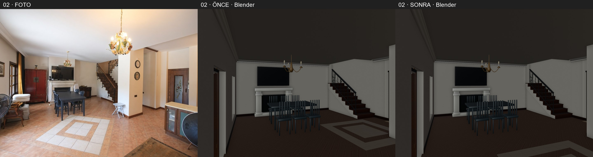

### Foto 03

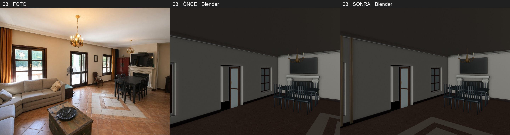

### Foto 04

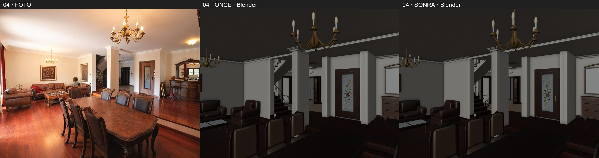

### Foto 05

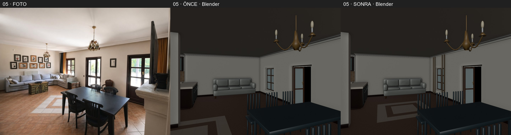

### Foto 09

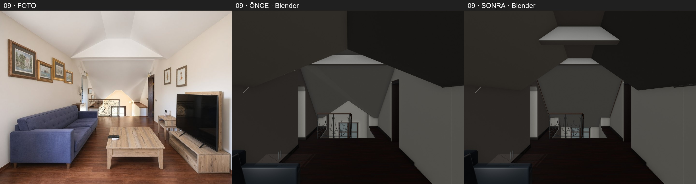

### Foto 10

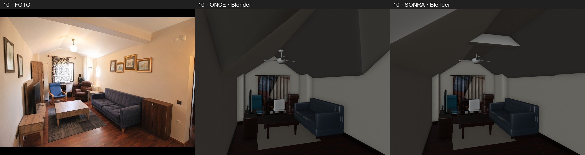

### Foto 13

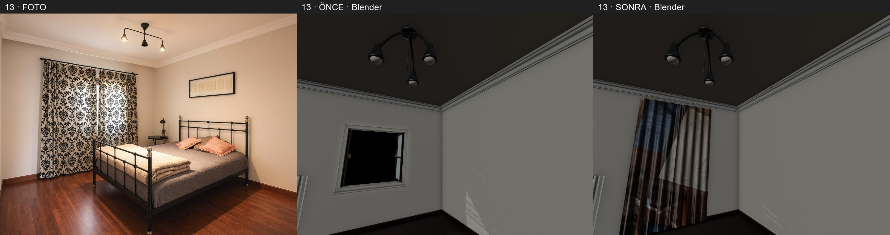

### Foto 21

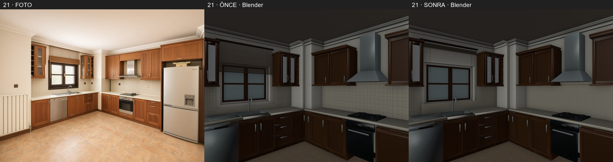

### Foto 23

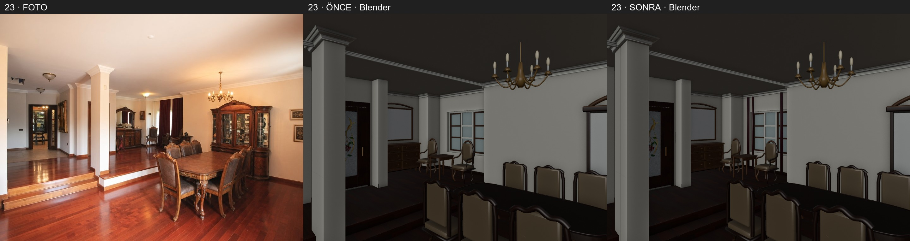

### Foto 29

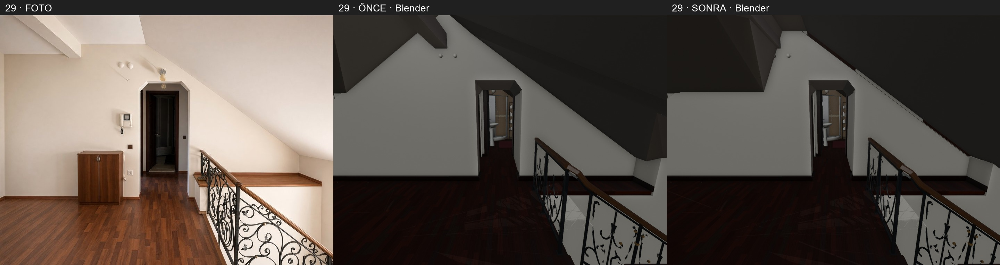

### Foto 32

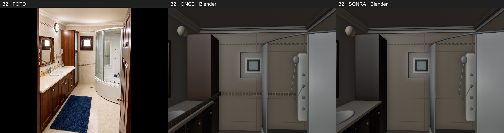

### Foto 33

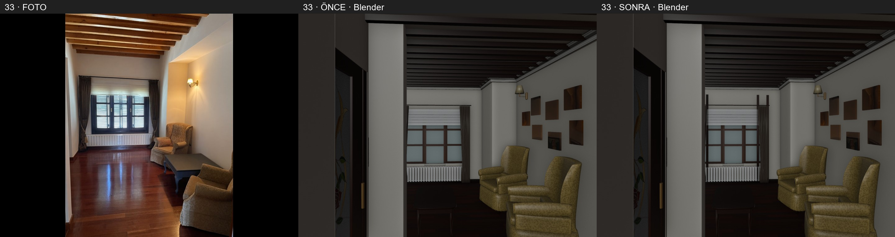

