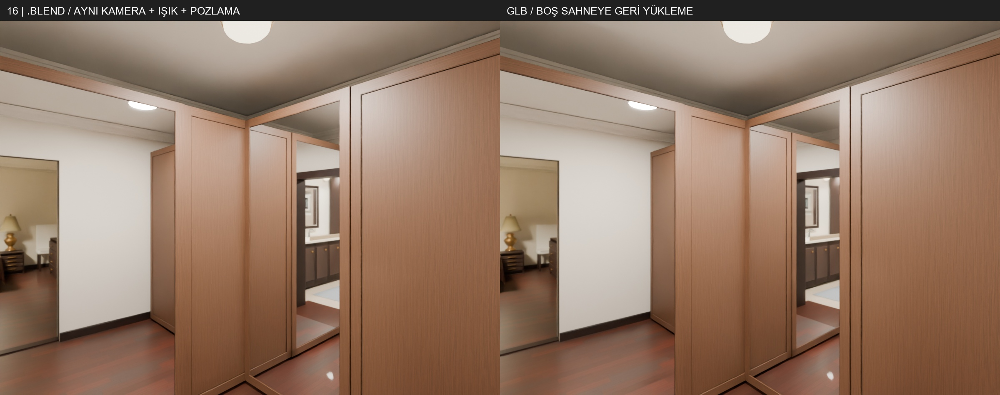
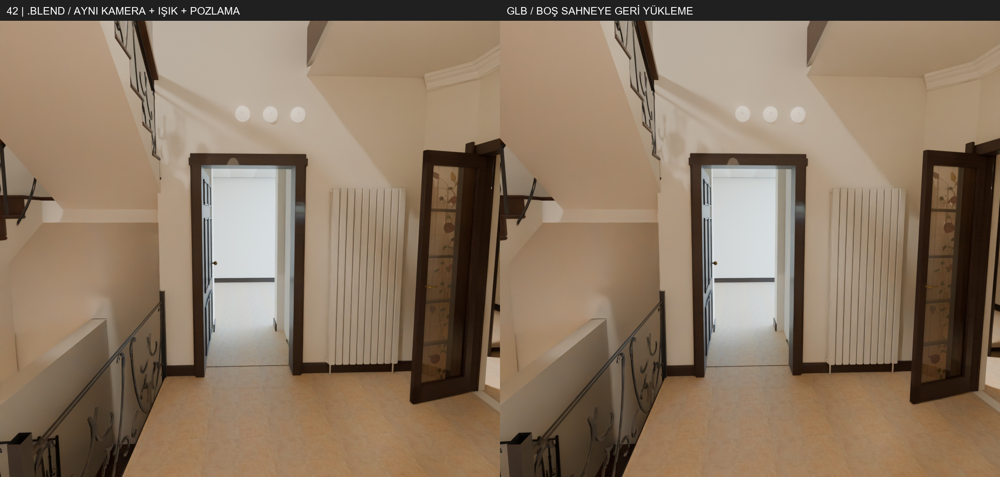

# Adım10 · Aşama1 geometrisi — UV1 olmadan web teslimi

Kaynak: `angora-tur10/adim10/sahne.blend`. Eski model korkulukları ve 16/21/02 düzeltmeleri dahildir. UV denemeleri, yüz çevirme denemeleri ve lightmap verileri kullanılmadı. GARDEN-opt-v2 aynı kaldı.

BUILDING alt ve üst birlikte yüklenir; mimari EKLER bunlara dahildir. INTERIOR eski mobilyaları korur. Ayrı EKLER yüklenmez.

| Dosya | Bayt | Üçgen | Validator hata / uyarı |
|---|---:|---:|---:|
| BUILDING-opt-v6-alt.glb | 83355672 | 471479 | 0 / 0 |
| BUILDING-opt-v6-ust.glb | 80841384 | 497412 | 0 / 0 |
| INTERIOR-opt-v3.glb | 61348456 | 343671 | 0 / 0 |

Her üç dosyada TEXCOORD_1 sayısı **0**. Yalnız malzeme UV0 vardır. Dokular 2048 px: albedo JPG, normal ve metallic-roughness PNG (G roughness, B metal). Geometri/doku sıkıştırması yok; ışık nesneleri dışa aktarılmadı. Kat ve kaynak kimlikleri extras alanlarındadır.

Boş sahneye geri yüklenen 1621 grubun en büyük sınır farkı **0.000000476837 m**; 1 mm kontrolü geçti. Dokunulmayan kaynak grupların kontrolü de geçti.

[SHA256, boyut ve malzemeler](web-teslim.json) · [Koordinat, UV ve validator kontrolleri](web-kontrol.json) · [Işıklar](isiklar-v2.json)

Altı görselde sol Aşama1 .blend, sağ bu GLB'lerin boş sahneye geri yüklenmiş halidir. Kamera, ışık ve pozlama aynıdır; JPEG/2048 örnekleme ve shader aktarımından doğan piksel farkları web-kontrol.json içinde kayıtlıdır.

UV ve pişirme bu teslimin parçası değildir. Claude’un build/bake altına koyacağı *-lm.glb dosyaları bekleniyor. Önceki sahnede kayıtlı 32 bordür, 47 tavan birleşimi ve 34 eşik ayrıntıları değişmedi.
