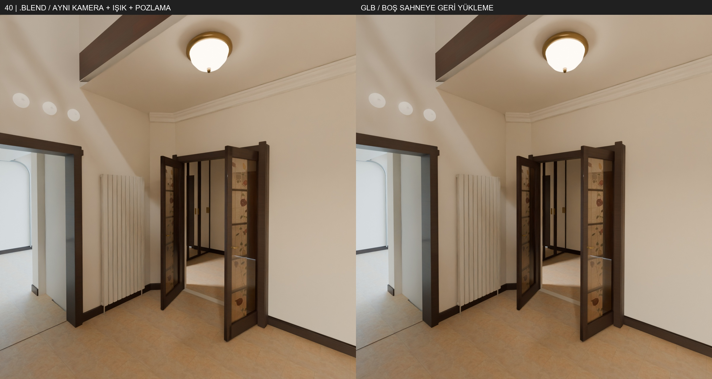

# Adım 09 B · Web teslimi

BUILDING tek dosyada 100 MB sınırını aştığı için ikiye ayrıldı. İki parçayı birlikte, aynı kök dönüşümüyle yükleyin; INTERIOR üçüncü dosyadır. Eski EKLER ayrıca yüklenmez: mimari ekler BUILDING parçalarının içindedir. Eski mobilyalar INTERIOR içinde korunur.

| Dosya | Bayt | Üçgen | Validator hata / uyarı |
|---|---:|---:|---:|
| BUILDING-opt-v6-alt.glb | 84,068,408 | 482,529 | 0 / 0 |
| BUILDING-opt-v6-ust.glb | 82,710,772 | 513,723 | 0 / 0 |
| INTERIOR-opt-v3.glb | 54,238,628 | 336,584 | 0 / 0 |

Tüm gömülü dokular 2048×2048: albedo JPG/sRGB, normal PNG/Non-Color; metallic-roughness PNG'de roughness G, metal B. Draco/Meshopt/KTX sıkıştırması yok. Işık nesneleri GLB'ye alınmadı; etkili kontrol ışıkları `isiklar-v2.json` içinde, glTF Y-up metre konumuyla verilir. Güneş/gök kaydı da bulunur. Site, ışık kurulumunu bu JSON'dan yapmalıdır.

Kaynak 46 mesh grubundan geometriye dokunulmayan 31 grubun kaynak sınır kutuları 1 mm koşulunu sağlar. Üç GLB'nin boş sahneye geri yüklenmesinde 1771 grubun en büyük sınır farkı 0.000000476837 m. Katlara bölünen parçalar özgün kaynak kimliğini extras içinde taşır; her nesnede kat etiketi vardır. Katlar arasında uzanan yeni mimari parçaların katı merkez yüksekliğidir.

Foto 01,02,18,21,34 karşılaştırmaları aynı kamera, ışık ve pozlamayla üretildi. Doku 2048 yeniden örneklemesi, JPEG ve gürültü temizleme nedeniyle piksel düzeyinde eşit değiller; sayısal farklar `web-kontrol.json` içinde. Foto40 desenli cam için JPEG RGB korunurken değişken alfa 128×256 yüzey ağına COLOR_0 olarak aktarıldı; ek karşılaştırma da eklendi.

SHA256, bayt, üçgen ve malzeme listeleri: [web-teslim.json](web-teslim.json). Denetimler: [web-kontrol.json](web-kontrol.json). Işıklar: [isiklar-v2.json](isiklar-v2.json).

## Kalanlar

DWG panelinin göreli çizgileri korunur; 1.00×0.80 m nominal detay ölçeği saha/ölçü çizgisiyle ayrıca doğrulanmadı. Foto32 bordür motifi birebir değil; foto47 sol üst tavan birleşiminde ince açıklık ve foto34 kapı altı ışık çizgileri kontrol .blend'inde de mevcut. Bu kusurlar GLB aktarımından kaynaklanmıyor; A notlarında kayıtlı.

Bu klasör siteye entegrasyon teslimidir; canlı sitenin dosya bağlantıları değiştirilmedi.
